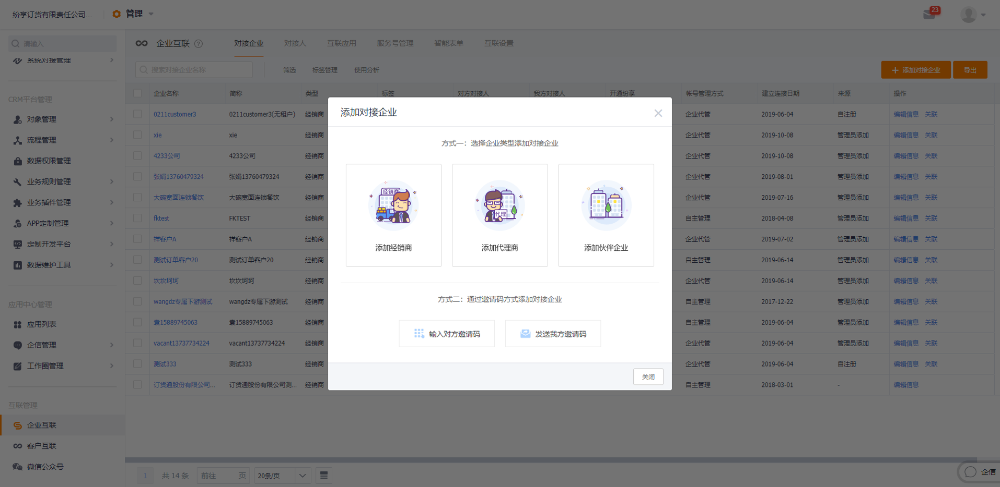
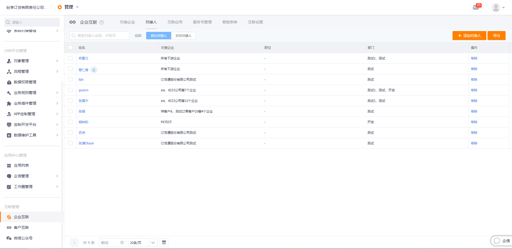

当前说明文档是基于购买了基础互联进行说明。
启用订货通需先行购买订货通应用，在购买订货通应用后，企业就可作为连接的上游进行应用配置和管理，为自己对接的下游企业添加订货通应用并建立连接。

未购买相关的“纷享企业互联-订货通应用”的企业，进入订货通应用后仅能作为对接的下游进行订货（订货需其他纷享企业用户将该企业添加到对接企业，并为该企业添加了订货通应用），不能让自己的对接企业向自己订货。

### 一、企业互联开启订货通

#### 启用订货通

开启互联成为上游并购买订货通后，首先需进入【企业互联】-【互联应用】，在互联应用中将看到已购买的所有企业互联应用，选择开启订货通。

  

#### 接入微信公众号

企业互联可选择性的进行绑定微信公众号，如果只需通过纷享APP和小程序进行订货就可以不绑定微信公众号。
开通互联应用-订货通后，如果企业希望经销商能通过微信服务号进行在线订货，管理员就需要接入企业自己的微信公众号，接入位置【管理】-【互联管理】-【微信公众号】

  

#### 维护公众号信息，接入订货通应用

在微信公众号页面选择已接入的微信公众号进行【配置】，进入具体的配置页面后就能对公众号的众多信息进行设置和管理。
接入订货通需进入【微信公众号】-【选择对应公众号配置】-【自定义菜单】，进入后在微信公众号底部菜单选择接入的位置，选中位置就可以选择应用了，在右侧就可以选择介入订货通应用。将订货通添加到微信公众号的菜单中后点击保存并发布，这样经销商登录微信进入公众号后，就能在企业微信公众号中进行在线订货了。具体添加应用的操作如下图

  

注意：

未开启订货通应用将不能在自定义菜单中的添加应用列表中出现“订货通”应用，开启后才会出现。

#### 维护客户对象，添加对接企业

客户对象中包含哪些企业，将决定互联管理员能添加哪些对接企业，管理员在CRM中的客户对象中将对接企业（下游经销商）信息维护好后，互联管理员就可以在企业互联中为自己添加对接企业了，添加为对接企业后才能使用企业互联，而此时添加的对接企业还不能进行在线订货，在线订货还需要将纷享互联应用-订货通添加到对接企业，表示对接企业有使用订货通的权限，为对接企业添加了订货通后，才能在订货通进行在线订货操作，否者对接企业不能进行订货。

当购买新的互联应用后也需要将新购买的应用添加到对接企业的应用中，否者对接企业也不能正常使用。

  

  

  

注意：

此页面中涉及有租户/无租户两种模式，选择“是”为有租户模式，有租户模式将在纷享为对接企业的对接人创建账号，可通过纷享APP进入企业互联使用订货通进行订货；选择“否”为无租户模式，无租户将更加便捷，仅包含微信小程序与微信公众号进行在线订货，不会创建纷享账号，不用下载纷享应用，微信就可完成订货。当自己的业务不需要用到纷享时，建议选择默认的“否”进行创建。

#### 维护联系人对象，添加对接人

联系人对象中包含哪些人员，同样的也将决定企业互联中能添加哪些对接人，对接企业的员工信息已添加到CRM联系人对象后就可以在企业互联中对对接人进行管理设置了，对接人分我方对接人（企业内部员工）与对方对接人（对接企业员工）

  

  

  

联系人被添加到对接企业的对接人后，将收到短信通知:

1）联系人所在企业添加到对接企业是无租户

短信通知要求对接人搜索企业微信服务号进行账号绑定，无租户登陆web端订货通可通过[dht.fxiaoke.com/](dht.fxiaoke.com/)直接微信扫码登陆。

  

2）联系人所在企业添加到对接企业是有租户

短信通知将告知登录纷享的账号（对接人的手机号）和密码，并告知纷享的登陆网页[www.fxiaoke.com](www.fxiaoke.com)

将对接企业的联系人添加到对方对接人后，对接人通过短信通知的内容进行登录或绑定后就可以进入订货通进行在线订货了。

注意：

1、添加的对接人必须是创建了联系方式的联系人。

2、对接人没有在企业互联的应用管理中被限制权限，在【管理】-【企业互联】-【互联应用】-【订货通】-【设置】-【功能权限】中编辑权限可对对接人的权限做限制，如限制不能创建销售订单，则不能完成订单提交动作。

### 二、微信小程序

微信小程序订货，针对企业互联用户，已添加的企业对接人同时可以通过微信小程序进行在线订货，第一次进入需要验证绑定个人身份，需保证输入的手机号与对接人填入的手机号信息一致，不一致身份将得不到验证。

进入微信搜索【纷享订货通】

  