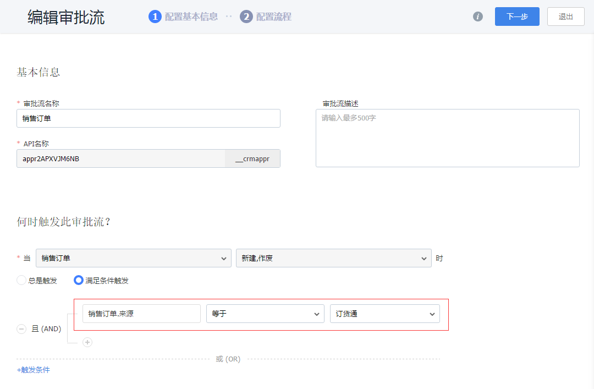

## 商品管理

### 1. 商品

CRM系统中商品、产品两个概念，在订货通中是基于商品来显示的，而提交订单是基于产品的。这与标准的电商模式一样。当商品有多种规格时，就需要创建多个产品，否则就是一个商品一个产品。为了给下游经销商、代理商、客户等提供良好的订货体验，需要维护以下信息：
- 图片：订货通就是打造B2C的订货体验，类似与京东、天猫、1号店等，所以图片的维护是必须的。
- 分类：建议不要设置太多分类层级，对于快消、服装、电器等行业，建议控制在2层以内
- 价格：开放订货通后，下游就直接可看到价格，并按设置的价格订货，所以务必检查价格
- 是否有规格：如果有多规格可启用，否则不启用，系统就会自动创建一个产品。
- 条形码：维护条形码后，在订货通就可以直接扫描订货了。
- 批次与序列号管理：当有批次或序列号管理诉求时，可启用这两个能力。

其他基本设置或操作，参考CRM手册即可。

### 2. 产品

产品是通过商品+规格自动生成的，主要属性就是价格、产品编码、条形码、可用库存等信息。为了给下游经销商、代理商、客户等提供良好的订货体验，需要维护以下信息：
- 图片：当每个产品（sku）都有不同的图片时，可更新商品的图片，否则不需要额外添加。
- 价格：开放订货通后，下游就直接可看到价格，并按设置的价格订货，所以务必检查价格
- 多规格：在CRM中多规格会显示为多个产品，而在订货通中将合并为一个产品组，用户可选择不同的规格购买
- 条形码：维护条形码后，在订货通就可以直接扫描订货了
- 安全库存：启用库存后，会增加安全库存字段，当库存地域安全库存时，会提示库存管理员。

其他基本设置或操作，参考CRM手册即可。

### 3. 价目表

当公司针对不同的经销商、代理商、客户，销售的产品范围、产品价格不同时，那就需要开启价目表。

1）启用价目表

在【CRM】-【CRM管理】-【业务规则设置】中找到“价目表和促销管理”，点击启用。启用后，刷新页面，会增加价目表、价目表产品对象，预设CRM管理员、产品管理员有管理权限，如果需要可自行分配权限。
启用价目表之后，创建订单时，需要选择价目表，然后再选择价目表产品。不在价目表中的产品，是无法选择的。

2）标准价目表说明

开启价目表之后，系统默认增加一个标准价目表，并将所有产品、所有客户都加入这个标准价格表。新增的客户、产品会自动加入。标准价目表可停用，但不可作废。

3）创建价目表

公司可根据不同的客户分类创建不同的价目表，根据需要可创建多个。具体操作，可参考价目表的设置。

4）审批流设置

开启价目表之后，默认并没有创建审批流。如果需要，企业可自行创建审批流。

5）特别说明

为了给下游客户提供良好的体验，建议一个客户不要定义太多价目表。如果可能的话，针对一个客户，在一定的时间段，价目表尽量唯一。这样下游经销商进入订货通，就可以直接订货，而不需要去选择价目表。

  

