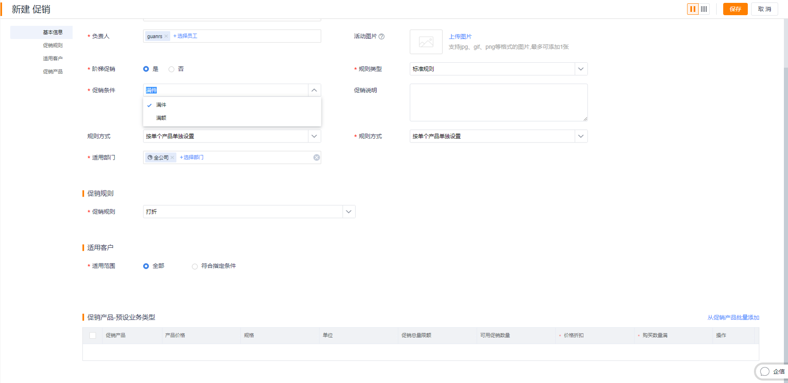
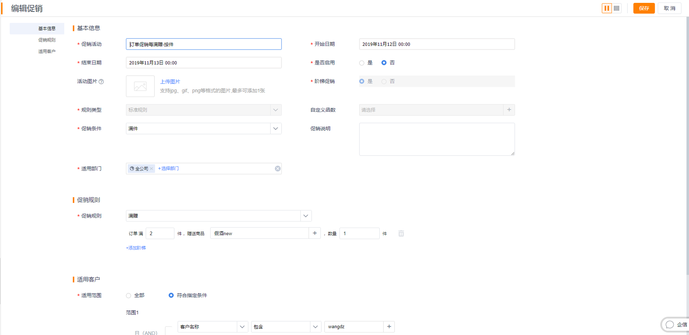

## 促销管理

对于快消、农牧、电子、服装等行业，如果有促销的需求，可开启促销功能。促销启用后，自动增加促销、广告模块。

### 1. 促销

1）启用促销

在【CRM】-【CRM管理】-【业务规则设置】中找到“价目表和促销管理”，点击启用。启用后，刷新页面，会增加促销对象，预设CRM管理员、产品管理员有管理权限，如果需要可自行分配权限。

   
	 
2）创建促销

<video controls width="750">

    <source src="./media01/Promotion.mp4"
            type="video/webm">

    <source src="/media01/Promotion.mp4"
            type="video/mp4">

    Sorry, your browser doesn't support embedded videos.
</video>

目前促销覆盖三个核心场景：商品促销、订单促销和组合促销：
 
- 商品促销：可针对商品设置打折、减价、一口价、满赠等促销规则，支持设置促销时间和客户适用范围。
    - 赠送本品
        - 对于买赠规则，既可以赠送其他商品，也可以赠送本品。
        - 对于本品，在订单中自动显示为零。
    - 促销数量限额
        - 当厂家需要促销来刺激销售，但有希望控制成本，可设置促销的数量限额。比如方便面本次促销为1万箱。根据不同的促销规则，数量限额用完后的影响不同：
        - 打折、减价、一口价：数量限额用完后，将回归到标准价格
        - 买赠：数量限额用完后，将无赠品。

   

- 订单促销：可针对订单设置满折、满减、满赠等促销规则，支持设置促销时间和客户适用范围。

- 组合促销：可自由搭配数量不同的各类商品组成套餐，对套餐这个整体支持组合打折、组合减免、组合一口价、组合买赠等促销规则，支持设置促销时间和客户适用范围。
    - 组合促销不支持阶梯促销形式。同商品促销相同只有买赠支持“每满”的促销形式。

   
   

**规则类型**：
- 标准规则：对于大部分的促销场景，以上三种促销类型中的折扣、减价、买赠等规则能满足需求，使用标准规则就可以了。
- 自定义规则：对于复杂的促销场景，比如购买A品类中的任意一个商品2件，搭上特定B商品 1件，就可以赠送C 1件。标准规则就没有办法了，需要用到自定义规则。自定义规则是通过自定义函数的能力，由客户自行编写规则去实现复杂的，个性化的促销场景。 

   

**其他规则说明**：
- 促销条件：对于任何促销类型，都可以支持满件、满额的促销条件。比如根据客户需要，可设置“购买商品A 50件，打9折”，也可以设置为“购买商品A 2000元，打9折”。
  - 商品促销：促销条件默认为“满件”，促销商品中限额为“促销数量限额”。可设置为“满额”，同时促销商品的限制就调整为“促销金额限额”
  - 订单促销：促销条件默认为“满额”，可调整为满件
  - 组合促销：暂不支持促销条件

   

- 阶梯促销：任何一个促销都可以设置多个阶梯，比如购买100件，打9折；购买1000件，打8.5折，购买10000件，打8折，这个场景就定义三个阶梯即可。
- 每满的促销形式（产品每满多少什么，就赠送多少什么）
    - 每满的促销规则简化了阶梯促销，阶梯促销默认为“是”，更改为“否”时，去掉添加阶梯的入口，相关 的促销规则改变为支持每满场景。目前只有“买赠”支持每满。
    - 举例:设置A商品为每满促销规则，每购买A商品20件赠送B商品5件，则买40件A商品赠送10件B商品，买60件A商品赠送15件B商品，以此类推。
    - ==注意：==组合促销只支持购买每一套赠送赠品的每满规则，不支持多套购买赠送赠品的每满规则。

  

- 当客户同时参加多个商品促销、或订单促销时，根据预设的逻辑确认唯一的促销：
    - 取开始时间最近的
    - 如果开始时间相同，取结束时间最近的
    - 如果开始时间和结束时间都相同，则去最近创建的
- 一个客户可同时参加商品促销和订单促销，先计算商品促销，然后再计算订单促销
- 参加促销后，商品促销折算成订单产品折扣，订单促销折算为订单折扣
- 组合促销规则：
    - 组合打折计算规则：购买1套组合商品，比如A 5个，50元/个，9折；B 3个，40元/个，8折，则组合套餐折扣=（5x50x0.9+3x40x0.8）/（5x50+3x40）
    - 组合减免计算规则：一套组合减价商品，比如A 5个，减免20元/个；B 2个，减免10元/个，则产品组合减价=5x20+2x10
    - 组合一口价计算规则：一套组合商品，比如A 3个，50元/个，现价30元/个；B 1个，40元/个，现价20元/个，则产品组合一口价=3x30+1x20
    - 组合买赠计算规则：每购买组合商品赠送指定商品N件，赠送商品和数量可自行设置。目前只能支持单个赠品。
      - 赠品只能选择普通产品不能选择本品。
      - 促销产品只用编辑数量，不用编辑其他字段。
- 同一商品可同时参加多个促销活动，订单提交时不同促销活动的商品数量按照各自的促销规则计算，没有优先级和互斥的特殊规则。比如 A100元/件 A商品参加了 a组合打折 其中A有3件打9折； b组合一口价 其中A有2件90元，则提交订单时A商品=100x0.9x3+90x2

3）编辑促销

当遇到促销输入错误、促销时间延长、及应要求变更促销等场景，需要变更促销时，可通过编辑功能调整促销内容。
注：由于订单暂时没有存储促销的副本，暂只支持促销活动、开始日期、结束日期等3个字段编辑。
   

4）促销应用场景

目前只能在订货通使用，而CRM暂不支持促销。

5）促销效果衡量

对于促销的效果，可通过BI报表进行分析和查看。

### 2. 广告
促销启用后，自动增加广告模块。广告模块主要是设置广告banner，供订货通首页使用。Banner的跳转目前支持三类：跳转促销页面、跳转商品页面、跳转外部URL。

   

