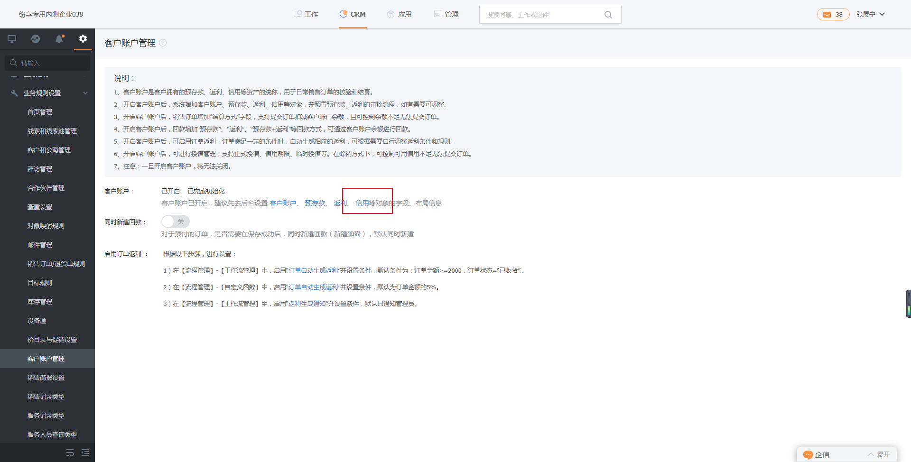
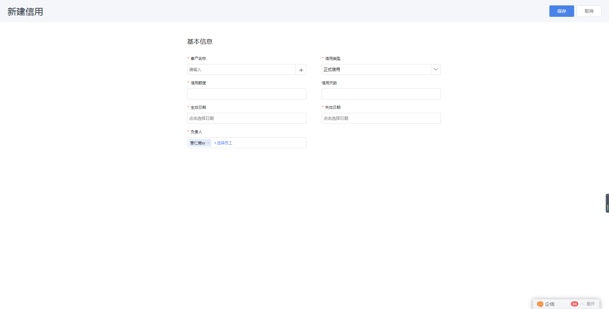
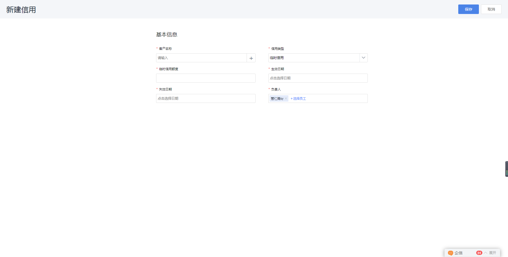
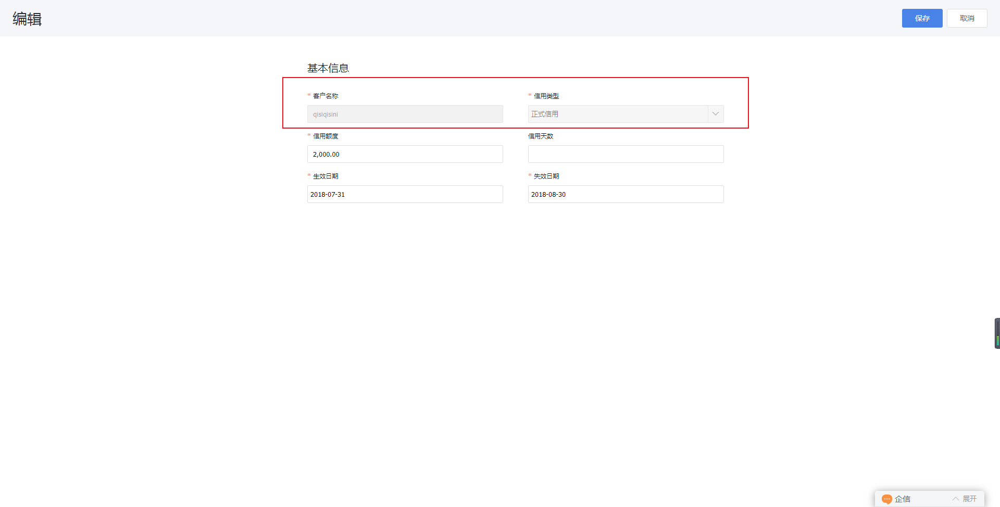

## 信用管理

信用包括信用额度、信用天数和信用有效期等内容，支持正式信用和临时信用，信用具有控制客户的业务往来的作用，包括合同、订单、发货单、出入库等业务。信用随客户账户的开启而自动启动。

### 1. 信用

1）启用信用

在【CRM】-【CRM管理】-【业务规则设置】中打开“客户账户管理”，可看到信用目前已被设置为默认启用。预设回款财务有管理权限，如果需要可自行分配权限。

   
	 
2）创建信用

目前信用包括：正式信用、临时信用
 
- 正式信用：可针不同的客户账户设置正式信用，支持对信用额度、信用天数、生效日期和失效日期等选项的编辑。

   

- 临时信用：也可针不同的客户账户设置临时信用，支持对临时信用额度、生效日期和失效日期的编辑。

  

- ==注意：==
    - 信用不可交叉，对于同一个客户，同一种信用类型，有效期不可重复、交叉，交叉则不能创建。不同信用类型不受以上规则影响。 **比如** A客户，创建一条正式信用a：10万额度、30天、有效期从2018-1-1到2018-12-31。当正式额度不足时，可创建一条临时信用b：1万临时额度、有效期从2018-6-1到2018-7-1，但信用b作为正式信用则不能创建。
   

3）信用编辑
- 信用一旦创建则“信用类型”不可修改，其他字段（信用额度、临时信用额度、信用天数、信用时间）可根据需要做调整。
- 客户账户中的信用字段包括信用额度、临时信用额度、信用天数、信用时间等不能编辑，只能通过信用对象更新到客户账户中。
-  ==注意：==
    - 编辑的信用对象也不能出现信用交叉否则不能保存。 

3）信用校验
对于提交为赊销的订单将会进行双重校验，即 信用额度校验 和 信用天数校验。
- 信用额度校验：对于结算方式为“赊销”的订单，当信用可用额度（临时信用额度+正式信用额度-已用信用额度=剩余信用额度）不足时，无法提交订单。
- 信用天数校验：客户提交赊销订单，系统将校验是否有已提交的赊销订单，有则信用天数是否超期还未付款，未付款则客户不能继续提交订单。

## 2.客户账户
客户账户中可查看到信用的相关内容包括信用天数、信用额度、临时信用额度和信用可用余额等信息。

1）客户账户中的信用相关信息关联信用对象。
- 信用额度 赋值给 客户账户.信用额度；
- 信用天数 赋值给客户账户.信用天数；
- 临时信用额度 赋值给 客户账户.临时信用额度：
- 临时信用额度+正式信用额度-已用信用额度=剩余信用额度

2）在客户账户中的信用额度和临时信用额度只显示当前可用的有效信用，未生效或已过期信用会以显示为零的形式更新到客户账户中。

  

