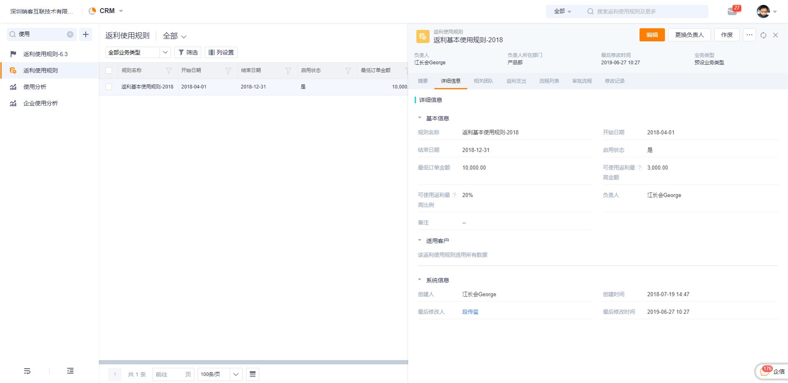

## 客户管理

### 1. 客户

1）维护客户信息

根据企业互联的设置，对接企业可直接通过CRM客户创建。如果新的合作伙伴需要开通订货通，需要先创建为CRM的客户，维护好客户类型、客户级别、地址、联系人等信息。
- 客户类型：可区分为客户、代理商、经销商、终端客户等，在互联创建对接企业时，进行分类管理
- 客户级别：可用于价目表、仓库、促销等业务的设置
- 地址：订单的送货地址，地址需要办公地址、联系人、联系方式等信息
- 联系人：联系人作为下游的订货人员，必须要维护

  

2）注意事项

- 为了业务的严谨性，建议报备通过的客户才开通订货通
- 需要保持客户状态正常，当客户作废后，下游将无法使用订货
- 当客户创建后，需要增加下游的订货人员，可直接在企业互联中，添加对方对接人。（添加CRM联系人不会自动添加对接人）

### 2. 客户账户
对于有预存款、返利需求的企业，可以手动启用客户账户功能。
客户账户是客户拥有的预存款、返利、信用等资金的统称，用于日常订单的结算和校验。对于预付方式的客户，只有足够的客户账户余额方可下单。

1）启用客户账户

在【CRM】-【CRM管理】-【业务规则设置】中找到“客户账户管理”，点击启用。启用后，刷新页面，会增加客户账户、预存款和返利几个对象。

  

客户账户初始化说明：
- 启用客户账户时，会对CRM所有客户自动创建客户账户，待完成所有客户的创建后，才能成功开启
- 当CRM客户数量超过1000条时，为了不影响业务的正常处理，系统开启后台任务，并自动在晚上完成初始化工作，完成后会发送CRM通知给管理员
- 启用客户账户后，新增的客户会自动创建客户账户

2）客户账户余额更新

客户账户的预存款、返利余额，会在预存款/返利增加、扣减后，进行更新。
对于预存款收入、返利收入，确认后会直接更新实际余额和可用余额；对于预存款支出、返利支出，在提交后会扣减可用余额，待确认后，扣减实际余额。

3）客户账户维护

系统默认客户账户的结算方式为“现付”，信用额度为空，如果有需要可以调整。
- 调整默认结算方式和信用额度
    - 如果希望新建客户的客户账户默认都是“预付”或默认给予5000的信用额度，则可以在字段管理中，设置默认值即可。（同CRM标准的自定义对象操作） 
- 批量调整结算方式和信用额度
    - 对于之前初始化或已经创建的客户账户，如果需要调整结算方式、信用额度，可以通过批量导入更新的方式来处理。

#### 3.	预存款

客户账户启用后，预存款就可以使用了。系统通过两个业务类型实现收入与支出的控制，两个业务类型和布局都是预设，不支持禁用、删除。

  

1）创建预存款收入

- 线下创建
    - 线下支持现金、网银转账、电汇、支付宝等多种方式，销售人员收到收款凭证后，直接录入系统，创建预存款即可，确认后更新客户账户预存款余额和可用余额。
- 线上充值
    - 下游的经销商、代理商、客户，可通过订货通在线充预存款，并直接更新客户账户预存款余额和可用余额。（预设流程默认跳过审批）
  

2）线上充值与企业钱包

对于线上充值，系统会将资金存入到上游的企业钱包账户，同时生成预存款收入记录。企业钱包中的资金，企业可自行取用，这个并不关联产生预存款支出记录。也就是说，实际资金使用和预存款支出并没有直接的关系。

注意：
- 线上交易是有一定的手续费，每次充值支付平台收取一定的费用，使用和提现不再收起。基准手续费为0.6%，每充一笔就扣一次费用，最低1元。 

3）预存款支出
- 手动扣减：销售人员或财务人员创建一张支出单，经过确认后，扣减客户账户中的预存款余额。
- 自动扣减：上游创建回款或下游付款时，选择回款/付款方式为“预存款”，待回款确认后，系统就自动扣减了预存款，并生成了一条预存款支出记录。（自动扣减不适用预存款的审批流）

4）审批流设置

开通客户账户时，预存款有预设审批流，默认线下创建预存款收入，以及支出需要审核，而线上充值不需要，只预设了一个审批节点。如果有需要，管理员可自行修改审批流，可调整条件、节点、人员等。

5）自定义字段限制

由于预存款支出的核心场景在于订单抵扣，而这个抵扣是基于回款自动产生。万一企业自定义了必填字段，那就无法进行自动创建预存款支出了，为了业务的顺利展开，故预存款暂不支持自定义字段。

#### 4. 返利

客户账户启用后，返利也就可以使用了。与预存款不同，返利收入和支出不是两个业务类型，而是两个对象。页面上看到的返利就是收入，而支出挂在收入下面。

  

1）创建返利收入

返利收入有两种方式，包括手动创建、自动创建。
- 手动创建：选择客户、金额、返利有效期后，点击创建即可。与预存款不同，在有效期内的返利，待审批通过后，会更新客户账户的返利余额，但未生效或已过期的返利将自动扣减余额。
- 自动创建：
    - 在创建退款时，选择退款到返利，待返利确认后，系统自动创建一条返利收入记录，并预设返利的有效期为10年，从创建退款往后推迟10年即可。
    - 基于一定的规则，当订单确认或收货确认后，自动创建一条返利收入，比如按订单金额的5%创建返利。

2）创建返利支出

返利支出未支持手动方式，目前只有订单扣减自动模式。
- 自动扣减：上游创建回款或下游付款时，选择回款/付款方式为“返利”、“预存款+返利”，待回款确认后，系统就自动扣减了返利，并生成了一条返利支出记录。（自动扣减不适用返利的审批流）

注意：
- 在下游付款扣减返利时，系统自动扣减返利单（暂不支持手动选择返利单）。当需要多张返利单才够扣减时，会按照返利单可用金额从小到大的顺序进行自动扣减。比如本次使用返利回款500元，客户共有3张返利单，第1张可用返利300，第2张可用返利100，第3张可用返利500，则按照逻辑扣减顺序为2、1、3。

3）订单产生返利

当销售政策规定，经销商下订单后，会给予一定的返利，则就可以使用这个能力。可设定当订单确认、订单确认收货时，给予订单金额一定比例的返利，比如5%。通过工作流+自定义函数的能力实现。

  

- 自动创建返利：当订单满足条件后，系统将自动创建返利，收入类型为“订单返利”，记录订单编号
- CRM通知：创建成功后，会通知系统管理员，如有必要可设置通过相关财务或销售
- 返利审批与汇总：订单自动生成的返利默认不需要审批，如果同样需要审批，可以调整审批流。待审批通过后，再更新客户账户中的返利余额

  

4）返利使用限制

当厂家限定返还给经销商的返利有条件使用时，比如返利需要在半年内用完、每次使用返利不超过5千等，就可以创建返利使用规则，规则支持三个因素设置：
- 最低订单金额：比如订单超过500元，才可以使用返利
- 可使用返利最高金额：比如可使用最高金额为5000元，其他只能用其他方式付款。
- 可使用返利最高比例：比如可使用最高金额为20%，超出部分用其他方式付款。

可使用返利最高金额和最高比例可同时设置，逻辑上最较小的值，比如按20%算出来可使用返利金额为4000元，则可使用最高返利金额为4000元，而不是5000元。

  

5）审批流设置

开通客户账户时，返利收入有预设审批流，默认设置了一个财务审批节点。如果有需要，管理员可自行修改审批流，可调整条件、节点、人员等。

6）个性化定义限制

由于预存款的支出是直接由业务调用发生的，比如回款确认后，就直接扣减了预存款余额。万一客户自定义了一个必填字段，那就无法进行自动扣减了，为了业务的顺利展开，故预存款暂不支持自定义字段。
