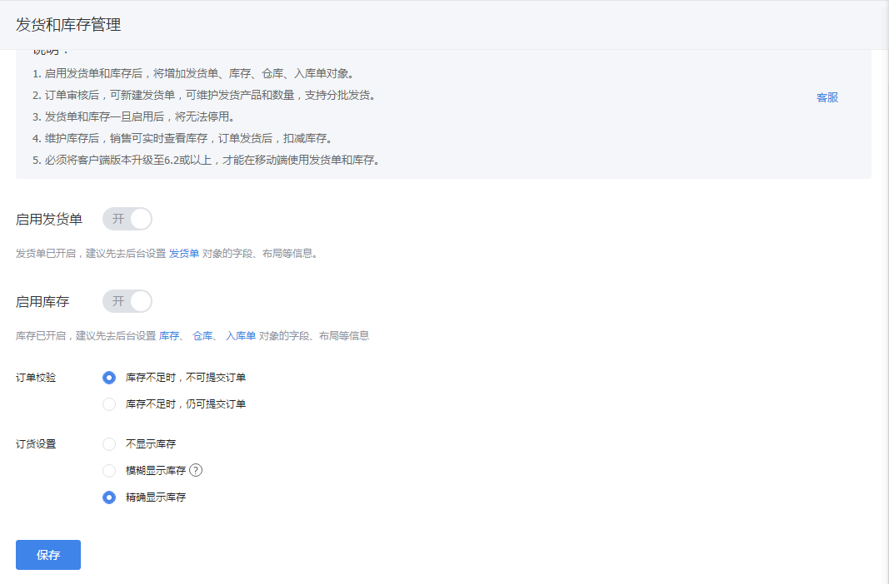
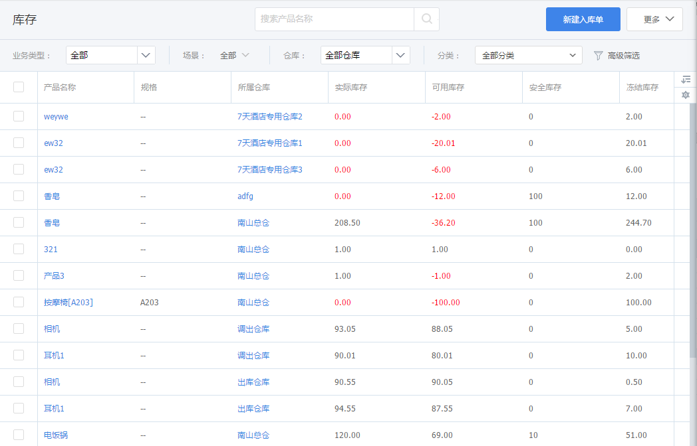

## 库存管理

库存作为独立业务，也是需要单独开启的。如果有需要，管理员自动开启即可。

在【CRM管理】-【业务规则设置】-【库存管理】中找到“库存”，点击开启。开启后，刷新页面，会增加库存、入库单、仓库对象，预设CRM管理员、产品管理员有管理权限，如果需要可自行分配权限。
开启后，下游可随时查看库存，及时进行补货。另外，订单提交时，会冻结库存。当设置库存不够时，不允许提交订单，则需要及时补货，否则销售或下游客户都无法下单。

  

### 1. 库存

通过入库单增加库存，通过发货单减少库存。库存维护后，发货人员、销售人员等角色可随时随地查询库存，支持分仓库查询。
- 入库：启用库存后，只能通过创建入库单增加库存，不能手动修改库存数量
- 出库：创建发货单自动扣减库存
- 库存查询：可通过产品名称、分类、仓库进行查询
- 缺货查询与预警：当库存量低于安全库存时，系统发送预警

  

### 2. 入库单

不管是采购的货物，还是生产的货物，都可以通过入库单，进行入库操作，增加相应仓库的库存。如果有需要可直接导入，如果需要审批可设置审批流程。

### 3. 仓库

客户根据需要设置仓库信息。如果需要根据不同地区在不同仓库订货，则可配置仓库的适用客户地区范围。比如广东地区的客户使用深圳仓，北京地区的客户使用北京仓，则可以进行适用客户设置。

注意：
- 建议不要交叉设置，比如广东地区即可使用深圳仓，又可以使用广州仓。

### 4. 库存设置

根据业务需求，可设置多个参数：
- 订单控制
    - 库存不足不允许提交订单
    - 仓库不足，可提交订单
- 订货仓库设置
    - 单一仓库订货（优先显示默认库存的库存产品数量，校验库存优先校验默认库存，默认库存不足时随机校验适用的任一仓库）
    - 合并仓库订货（显示所有仓库的库存数量之和，校验库存时也是校验库存之和）
- 安全库存设置
    - 统一设置（安全库存以产品对象中设置的安全库存为标准进行校验）
    - 分仓库设置（可对各仓库中的产品分别设置安全库存数值，预警的校验按各仓库产品的数值进行校验）
- 库存预警
    - 开启后会根据安全库存发起预警，未开启将不会产生预警。
- 库存显示（改参数针对下游在订货通中的显示）
    - 不显示库存
    - 模糊显示库存：根据安全库存判断，显示缺货、少量、充足
    - 精确显示库存
