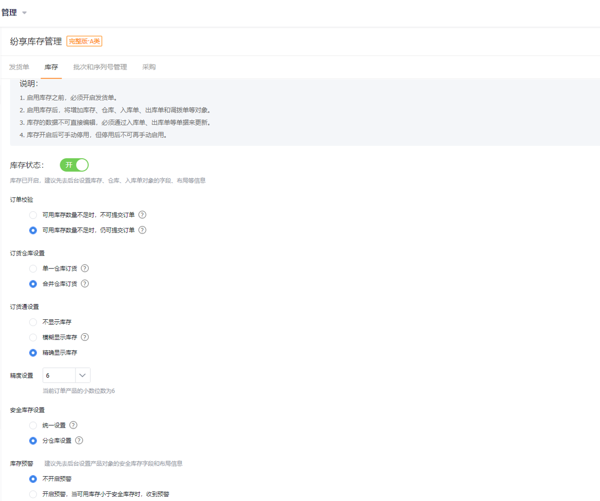

## 库存管理

库存作为独立业务，也是需要单独开启的。如果有需要，管理员自动开启即可。

在【CRM】-【CRM管理】-【业务规则设置】中找到“发货单与库存管理”，点击启用。启用后，刷新页面，会增加库存、入库单、仓库对象，预设CRM管理员、产品管理员有管理权限，如果需要可自行分配权限。
开启后，下游可随时查看库存，进行及时补货。另外，订单提交时，会冻结库存。当设置库存不够时，不允许提交订单，则需要及时补货，否则销售或下游客户都无法下单。

  

### 1. 库存

通过入库单增加库存，通过发货单减少库存。库存维护后，发货人员、销售人员等角色可随时随地查询库存，支持分仓库查询。
- 入库：通过入库单增加库存
- 出库：通过发货单扣减库存
- 库存查询：可通过产品名称、分类、仓库进行查询
- 缺货查询与预警：当库存量低于安全库存时，系统发送预警

  

### 2. 入库单

不管是采购的货物，还是生产的货物，都可以通过入库单，进行入库操作，增加相应仓库的库存。如果有需要可直接导入，如果需要审批可设置审批流程。

### 3. 仓库

客户根据需要设置仓库信息。如果需要根据不同地区在不同仓库订货，则可配置仓库的使用客户地区。比如广东地区的客户使用深圳仓，北京地区的客户使用北京仓，则可以进行设置。

注意：
- 建议不要交叉设置，比如广东地区即可使用深圳仓，又可以使用广州仓。

### 4. 库存设置

根据业务需求，可设置两个参数：
- 订单控制
    - 库存不足不允许提交订单
    - 仓库不足，可提交订单
- 库存显示（改参数针对下游在订货通中的显示）
    - 不显示库存
    - 模糊显示库存：根据安全库存判断，显示缺货、少量、充足
    - 精确显示库存
