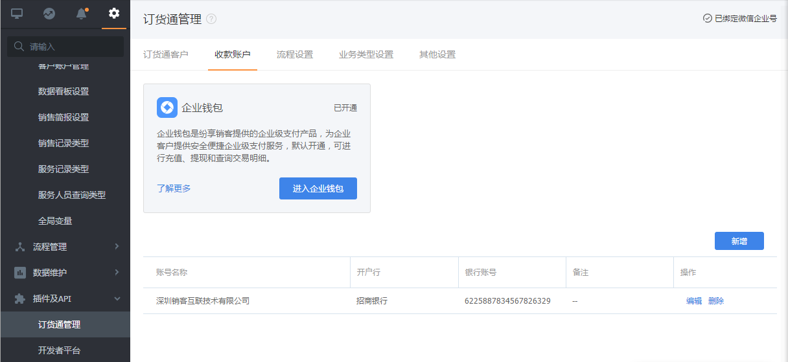
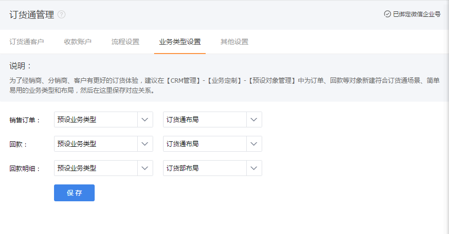
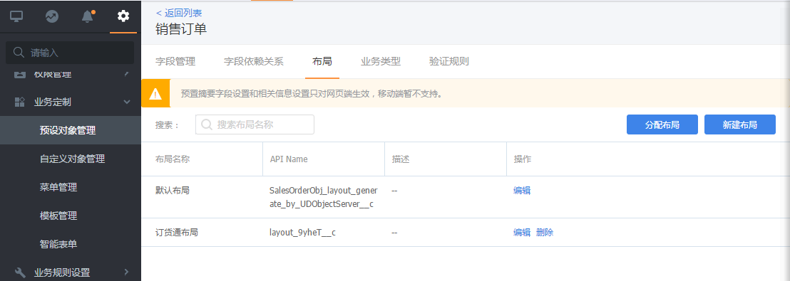
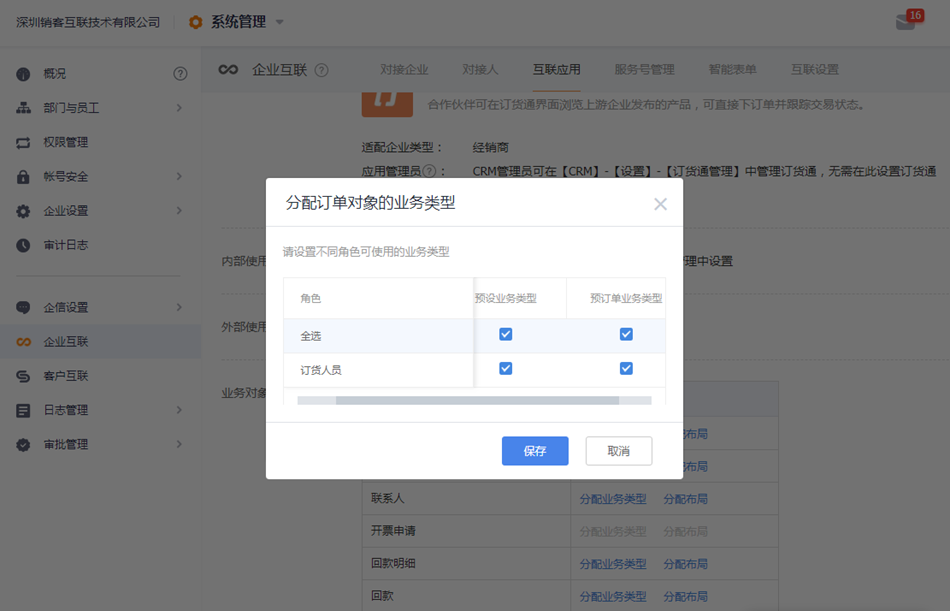
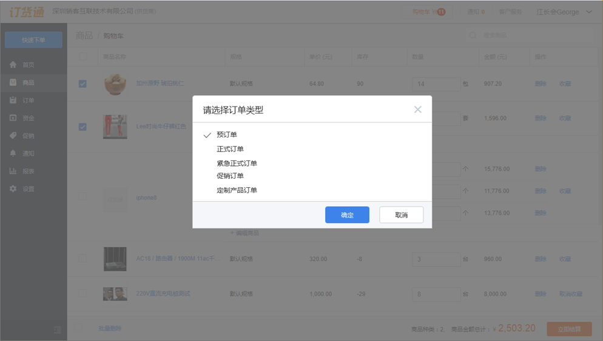
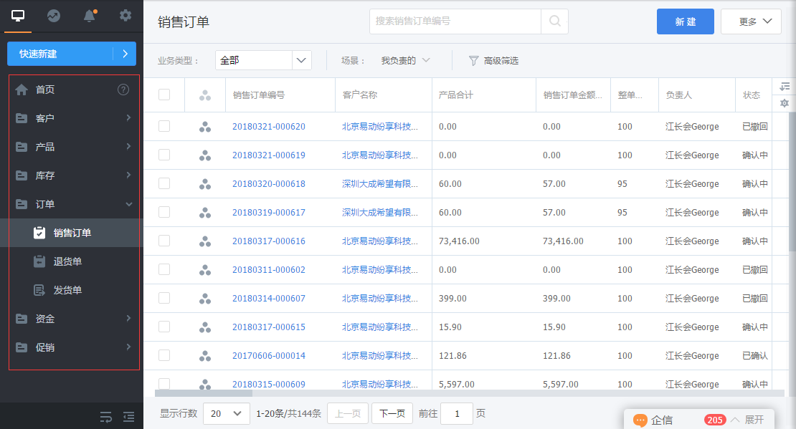
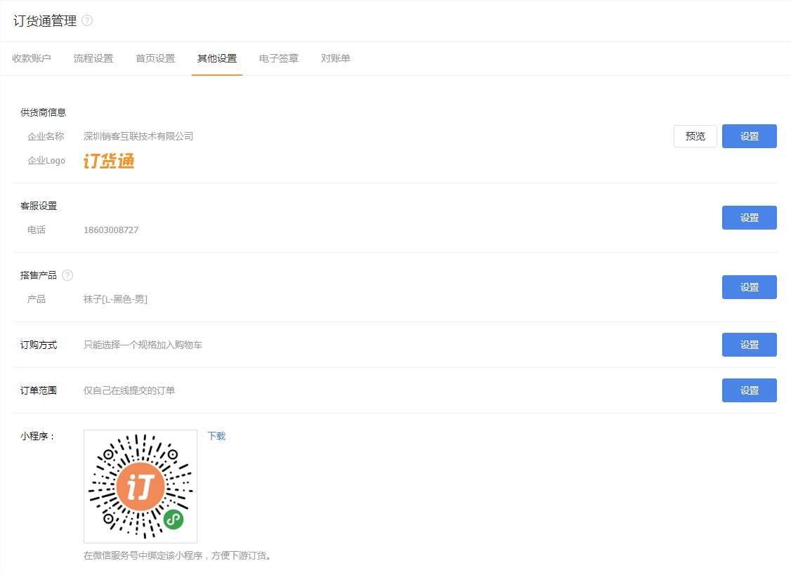
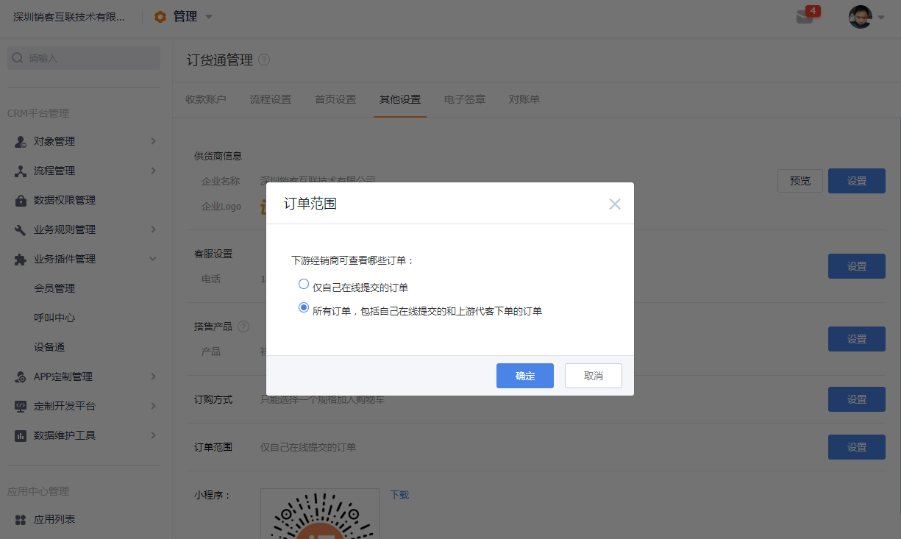

## 系统配置

这个的系统配置既包括订货通插件配置，也包括CRM相关能力的配置。

### 1. 收款账户
收款账户现分为线上支付与线下支付两类，可分别进行开启或关闭控制，
- 线上支付
   - 接入微信和支付宝，默认未接入，至少选择接入一个第三方账号后才能使用，当接入后可在订货通调用第三方支付进行线上付款操作，线上付款的资金将直接进入到企业接入的第三方账户。
- 线下支付
   - 对于线下付款，需要管理员录入收款账号。当下游提交付款时，就可以看到这个账号，然后安排线下打款。可支持添加多个收款账号。

   
 

### 2. 流程管理

这里的流程管理其实就是与订货通相关的流程，主要为订单的审批流程。该流程支持修改、重新配置或全部禁用
- 审批流程可进入【流程管理】-【审批流】进行设置，可对审批条件、审批节点、审批部门、审批人等进行自定义。
- 当订单的所有审批流程都已经禁用或废弃后，订单提交后订单状态就变更为已确认。

### 3.首页设置
订货通web端首页支持自定义，可以手动配置基础模块、互联应用、报表应用
- 当开启订货同时默认勾选全部的基础模块与报表应用；
- 勾选的互联应用在下游订货通进行显示时会根据应用权限进行过滤，当用户有勾选的应用权限时显示，没有勾选的应用权限也不会显示。

  

### 4. 业务类型配置
- 下游独立布局

为了给下游经销商、代理商、客户提供良好的订货体验，尽量操作简单。那建议在CRM订单里面增加一个布局，然后在业务类型设置中选择需要的业务类型和布局即可。
   

   
 
 - 多业务类型适配
 
 基于业务或管理目的，如果需要经销商、客户在线提交订单时选择业务类型，则可在企业互联应用中设置多业务类型。
   
   

### 5. 菜单配置
如果上游的角色主要就是处理订单，进行售中管理，建议设置一个菜单，比如订货通，隐藏一下不需要的功能，具体在【CRM】-【CRM管理】-【业务定制】-【菜单管理】新建即可。

   
 
 
### 6. 其他配置
其他配置还包括供货商信息、客服设置、搭售产品、订购方式等，具体说明如下：
- 供货商信息：调整好供货商名称及icon后，下游经销商在订货通就可以看见，加强品牌商的公司宣传。
- 客服设置：设置后，经销商可查看到客服信息，并发起联系，支持QQ、微信和电话等多种方式。
- 搭售产品：当有些特殊的产品，需要在经销商提交订单时自动带出来，就可以设置为搭售产品，比如保险、订单管理费等。
- 订购方式：对于服装、鞋袜等行业，希望一次性可购买多个规格，则可调整订购方式。
- 订单范围：订货通默认的规则是客户、经销商在线下单才能看到数据，但如果自己无法下单，需要厂家代为下单时，设置范围同样也能看到。

   
   