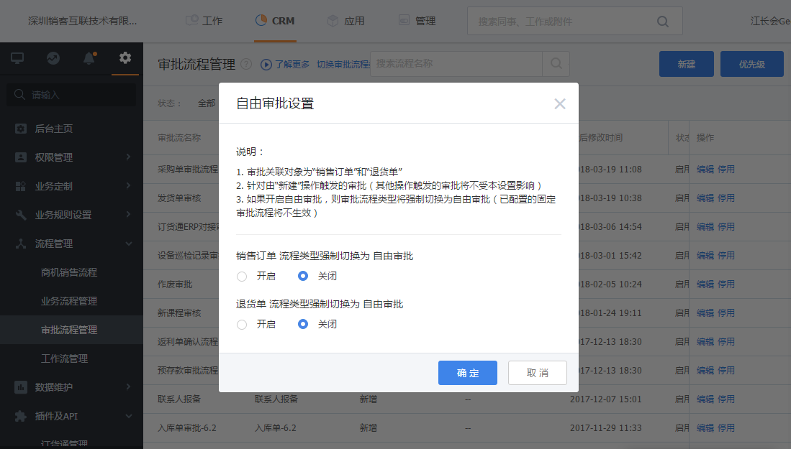

## 系统配置

这个的系统配置既包括订货通插件配置，也包括CRM相关能力的配置。

### 1. 收款账号
对于线下付款，需要管理员录入收款账号。当下游提交付款时，就可以看到这个账号，然后安排线下打款。可支持添加多个收款账号。

   
 

### 2. 流程管理

这里的流程管理其实就是订单的审批流程。在CRM流程管理中，支持自由流和固定流。
	自由流
如果CRM流程中是自由流，则订货通需要定义流程模板。
	固定流
如果流程是固定流，则订货通直接使用CRM的固定流程，不需要额外设置。如果上游的订单处理与订货通的流程不一样，可基于订单来源设置审批条件。

   

### 3. 业务类型配置
- 下游独立布局

为了给下游经销商、代理商、客户提供良好的订货体验，尽量操作简单。那建议在CRM订单里面增加一个布局，然后在业务类型设置中选择需要的业务类型和布局即可。
   

   
 
 - 多业务类型适配
 
 基于业务或管理目的，如果需要经销商、客户在线提交订单时选择业务类型，则可在企业互联应用中设置多业务类型。
   
   

### 4. 菜单配置
如果上游的角色主要就是处理订单，进行售中管理，建议设置一个菜单，比如订货通，隐藏一下不需要的功能，具体在【CRM】-【CRM管理】-【业务定制】-【菜单管理】新建即可。

   
 
 
 ### 5. 其他配置
其他配置还包括供货商信息、客服设置、搭售产品、订购方式等，具体说明如下：
- 供货商信息：调整好供货商名称及icon后，下游经销商在订货通就可以看见，加强品牌商的公司宣传。
- 客服设置：设置后，经销商可查看到客服信息，并发起联系，支持QQ、微信和电话等多种方式。
- 搭售产品：当有些特殊的产品，需要在经销商提交订单时自动带出来，就可以设置为搭售产品，比如保险、订单管理费等。
- 订购方式：对于服装、鞋袜等行业，希望一次性可购买多个规格，则可调整订购方式。
- 订单范围：订货通默认的规则是客户、经销商在线下单才能看到数据，但如果自己无法下单，需要厂家代为下单时，设置范围同样也能看到。
   
   