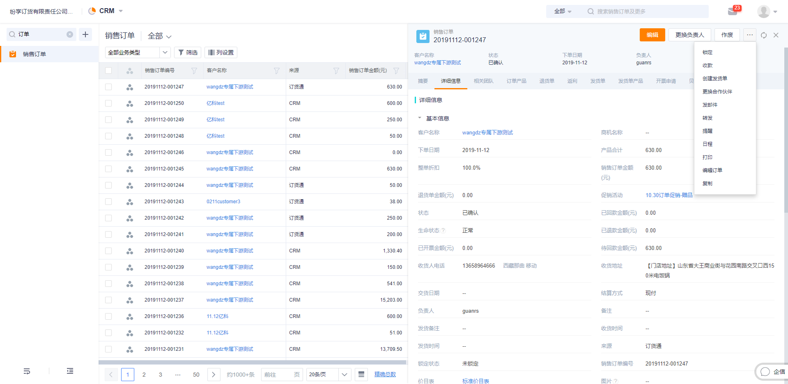

## 订单管理

### 1. 销售订单

不管是从crm创建订单，还是订货通创建的订单，都统一存储到CRM订单，操作与CRM订单一样。

1）订单审批

订单管理员根据CRM设置的流程，进行审批操作即可。当审批通过或驳回时，下游都可以收到通知。

2）确认发货

审批完成后，系统自动发消息，通知发货人员进行发货操作。

注意：
- 未开启发货单时，确认发货只是一个状态，但如果需要记录发货的产品，甚至分批发货，则需要发起发货单。

3）确认收货

上游确认发货后，下游经销商、代理商和客户在订货通会收到通知，待收到货物后，确认收货。操作完成后，整个订单的流程就处理完成了。

### 2. 退货单

当经销商、代理商和客户有退货场景时，可通过上游的销售、物流等人员，在CRM录入退货单，订货通暂未支持。

### 3. 发货单

对于实物产品的发货，如果需要记录发货的数量、物流信息，以及存在分批发货的场景，需要自行开启发货单。

1）发货单开启

在【CRM】-【CRM管理】-【业务规则设置】中找到“发货单与库存管理”，点击启用。启用后，刷新页面，会增加发货单对象，预设CRM管理员、发货人员有管理权限。如果需要可自行分配权限。

启用发货单时，如果有很多已发货，但未收货的订单，系统要求先确认收货。当然，启用的时候，系统也支持自动更新状态。	

2）创建发货单

发货单的创建有两个入口：
- 基于发货通知，在订单中创建发货单
    - 在订单中创建发货单，系统自动将订单编号、所有订单产品带入发货单，如果是整批发货，可直接创建。如果分批发货，可输入发货的数量。输入物流公司及物流编号后，可实时查询物流状态。

   

- 在发货单列表中，选择订单创建
    - 发货人员可以在发货单列表直接创建。选择订单后，也会带出全部订单产品，然后输入物流单号即可。

  

注意：
- 当发货人员没有订单的数据权限时，需要在CRM数据权限中，设置共享规则。

3）发货单审批

如果有需要，管理员可自行设置审批流程，系统未预设默认的流程。如果没有审批流，发货单创建后，就自动确认了，更新发货单状态为“已发货”。如果有审批流，待审批完成后，才更新状态。
发货单确认后，系统自动发送通知给下游。

4）确认收货

启用发货单之后，收货确认就是在发货单上，而不是订单上。对于多次发货，需要多次收货。当下游收到货物后，找到对应的订单及发货单记录，进行确认收货操作即可。
