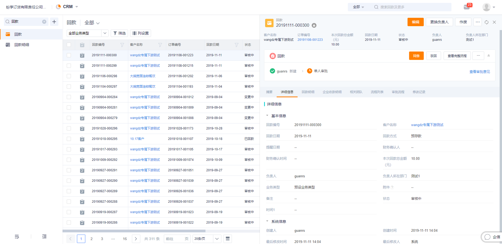

## 财务管理

### 1. 回款确认
下游提交付款后，上游财务人员根据流程设定，进行审批即可。
- 通过：最后一个审批通过后，下游经销商、代理商、客户就会收到确认通知
- 驳回：任何一个环节驳回，下游都能收到驳回通知

   

### 2. 退款
当下游需要退款时，通知上游销售或财务人员，创建退款单，这块能力在订货通暂时没有支持。

   
 

### 3. 开票确认

下游提交开票申请后，上游财务人员根据流程设定，进行审批即可。
- 通过：最后一个审批通过后，下游经销商、代理商、客户就会收到确认通知
- 驳回：任何一个环节驳回，下游都能收到驳回通知

   

