## 下游订货

在创建对接企业时，已经为下游经销商创建了纷享企业账号，下游可登录销客App进行订货。另外，我们也提供更加轻便的方式，下游可通过微信企业号、小程序订货。

### 1. 销客App订货

下游经销商可下载纷享销客App，登录系统向上游供货商订货。另外，也可以发起沟通、查看通知和网盘。

#### 1.1 应用入口

下游经销商登录纷享销客App后，在【应用】-【企业互联】应用中，找到上游提供的订货通应用，点击进入。

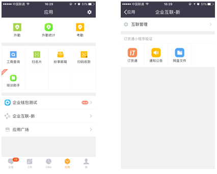  

#### 1.2 提交订单

1）订货通默认进入首页，点击【商品】进入商品主页，选择商品，点击商品后面的购物车icon，选择规则和输入数量，将商品加入到购物车中。

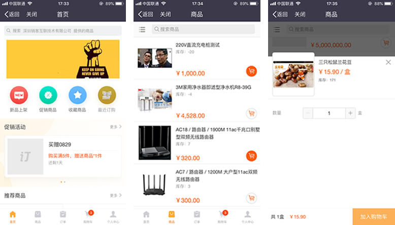  

注：当上游开启了价目表，且下游企业有多个价目表时，首页进入订货通，需要设置常用的价目表，保存后会更新价目表下的产品和价格。当有需要时，可切换价目表时。

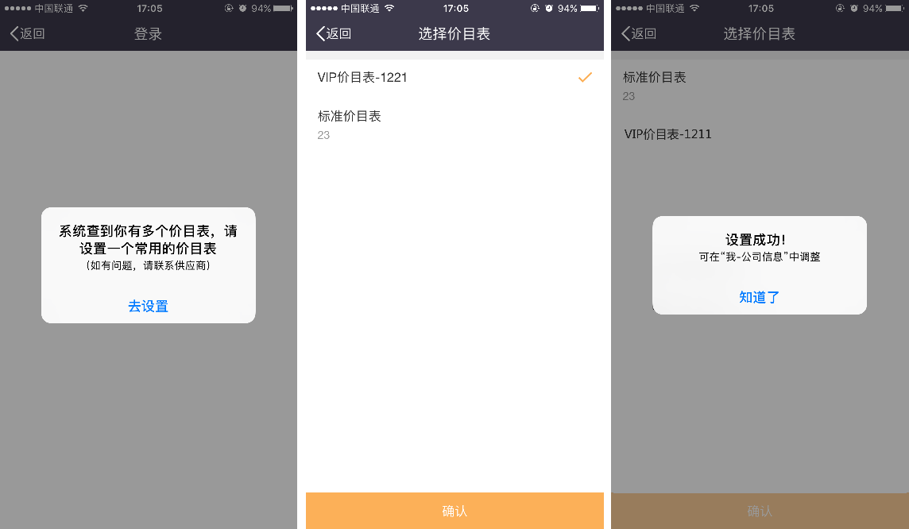  

2）继续增加其他商品，或通过商品详情添加，直到所需商品全部准备完毕。如果经销商需要一次性添加多个规则，可在订货通管理中设置，如下图。

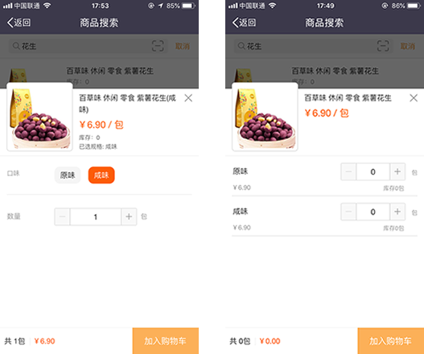  

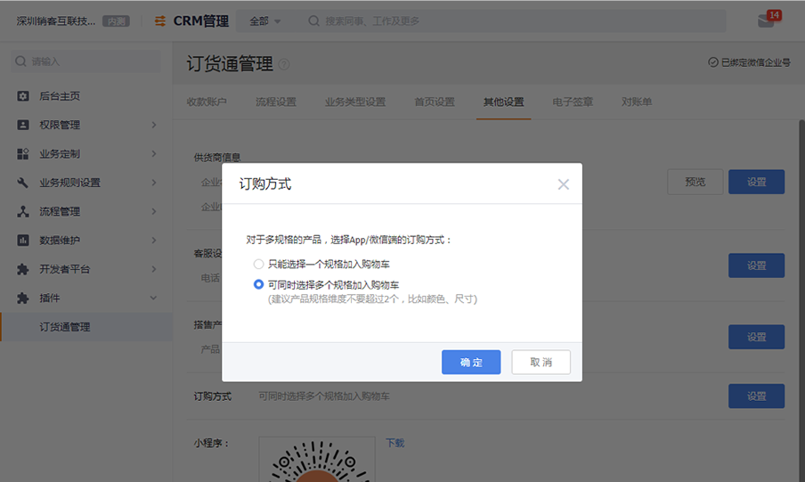  

3）点击购物车，检查商品和数量，确认后点击【结算】

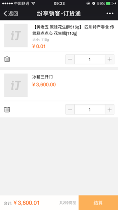  

4）在订单提交页面，确认金额，选择结算方式、交货日期、收货地址，填写发票信息，输入备注；

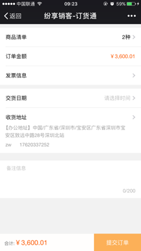  

注意：
- 结算方式的选择依赖上游启用客户账户管理，客户账户包括预存款、返利和预算。
- 结算方式包括预付、现付和赊销。预付需要有预存款和返利可用余额方可下单。具体可了解CRM的客户账户

5）点击收货地址后面的箭头，选择地址。如果没有，可自行添加。

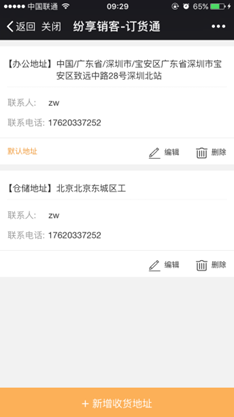  

6）提交订单后，提示订单提交成功，可查看订单详情或直接付款；

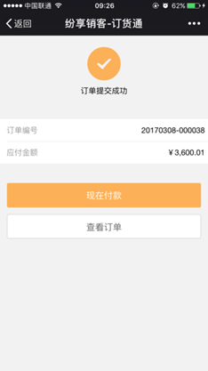  

注：
对于预付方式的订单，当资金账户余额不足时，无法提交订单。如果足够，且上游付款未设置自定义必填字段，则提交成功后系统扣减资金账户余额，完成付款。

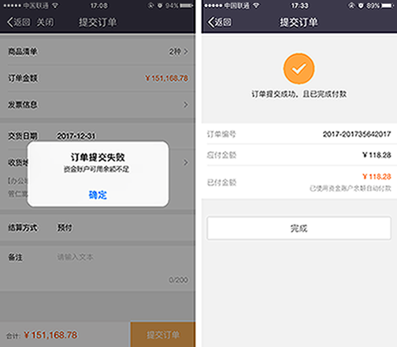  

7）订单提交成功后，企业中收到企业互联的通知，收到微信通知，提示订单已成功提交，等待供货方的审核；

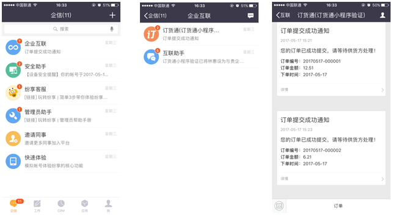  

#### 1.2 付款

在订单列表或订单详情页面，点击【付款】即可进入付款页面。

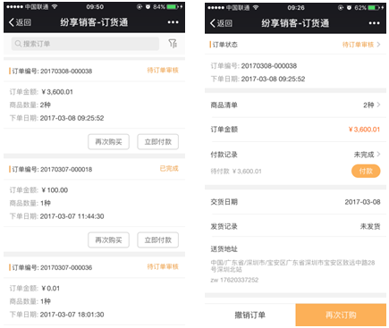  

默认付款方式为线上，点击确认，调起微信支付，点击确认支付，输入密码，即完成支付。成功后，点击确认返回订单详情即可； 

 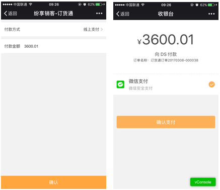  

如果选择线下转账，选择转账日期和收款账号，上传转账凭证，点击【确认】即可提交。

 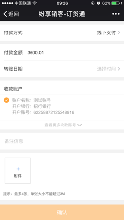  

如果选择资金账户，可分别输入使用预存款、返利的金额，当余额足够时，点击【确认】即可提交，系统自动扣减预存款、返利的余额，并生成相应的预存款、返利支出明细记录。

 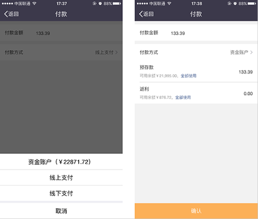  

付款成功后，在付款状态中，可查看付款记录，可看到每一笔付款通过什么方式支付的，是否已确认等信息。当供货方财务确认后，订货方会收到通知，付款状态变为已确认；

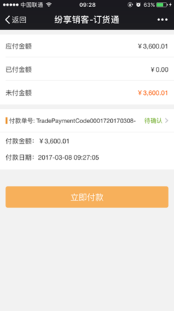  

注：对于预付的订单，已通过资金账户抵扣，就不需要重复支付。

#### 1.3 开票申请

如果提交订单时，没有提交发票申请，事后同样可提交。进入订单详情，进入发票记录中，点击【申请发票】即可。

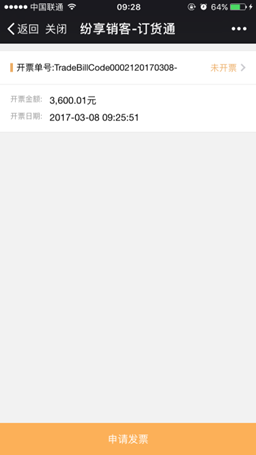  
	
提交的申请需要供货方审核并开票发票，审核后，订货方会收到微信通知。

#### 1.4 确认收货

待供货方订单审核完成，并准备好货物后，就可以安排发货了。在纷享里面操作发货后，订货通会收到发货的通知，待收到货物后，确认收货。在订单列表或详情都可以确认收货；

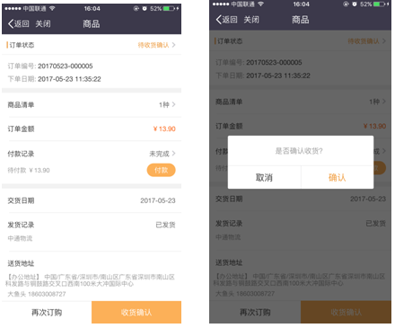  

#### 1.5 个人中心

个人中心可查看并设置个人账号，以及公司的基本信息。

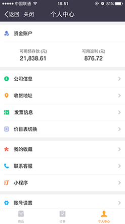  

- 资金账户

当上游启用客户账户后，在订货通中会显示资金账户。资金账户显示当前客户的所有预存款、返利的余额，及收入、支出明细。下游经销商可直接充值预存款。

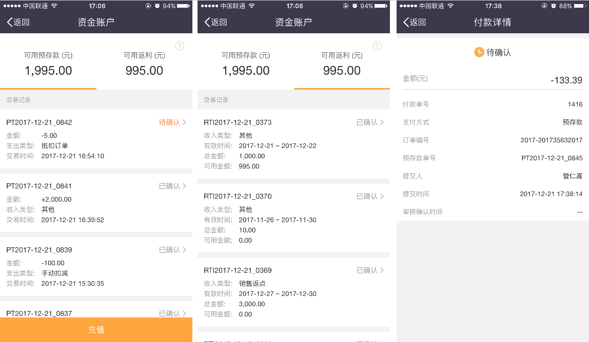  

预存款在线充值，在销客App可支持微信、支付宝和企业钱包。充值后，会自动增加资金账户的预存款余额。上游企业钱包管理员会到账通知。

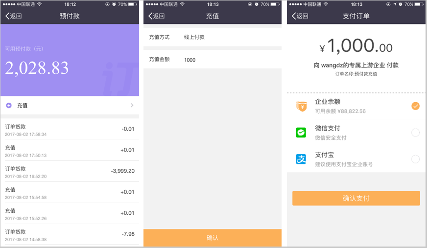  

- 公司信息

公司信息包括公司的基本信息以及发票抬头，同一家CRM客户的所有联系人看到的信息都是一样。

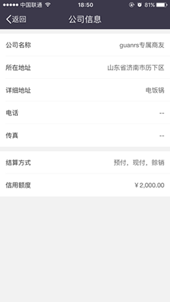  

- 收货地址

收货地址就是客户记录公司所有网点的收货地址，可设置多个，可新增。

  

- 发票信息

发票信息，就是开票的抬头信息，当一个公司有多个抬头时，可维护多个。

  

- 价目表切换

如有需要，可切换价目表。切换后，商品清单和价格将重置，旧价目表下的购物车和收藏商品会保存。

  

- 我的收藏

联系人可单独收藏自己常订货的商品，其他联系人看不到。

- 联系客服

如遇到任务问题，可直接联系客服进行反馈。

- 小程序

用微信扫描该小程序，即可在微信指哪个直接下单。
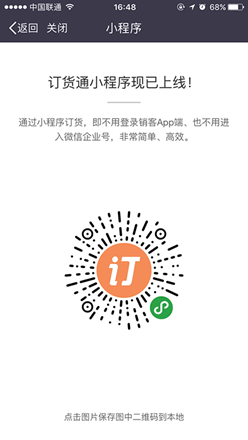  

- 账号设置

账号是指外部账号，而账号下面的信息都是CRM联系人的信息，供货方可调整自己的信息。

### 2. 微信企业号订货

如果上游绑定了企业号，则可直接关注企业号，在微信【通讯录】-【企业号】中找到您公司的企业号，点击进入，然后再点击【订货通】，进入订货通主页。

#### 2.1 应用入口

下游企业登录销客App后，在【应用】-【企业互联】应用中，找到上游提供的订货通应用，点击进入。

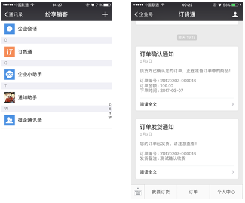  

### 3. 小程序订货

#### 3.1 应用入口

关注小程序“纷享订货通”，输入下游员工的账号，即可连接上游企业CRM系统，提交订单、查询订单，具体操作跟销客App一样，具体不做讲解。

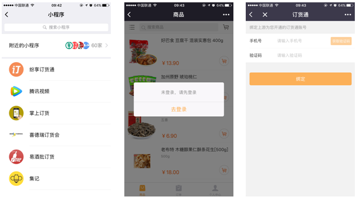  

### 4. Web独立网站

#### 4.1 应用入口

浏览器中输入dht.fxiaoke.com，输入下游员工的账号，即可连接上游企业CRM系统，提交订单、查询订单，具体操作跟销客App一样，具体不做讲解。

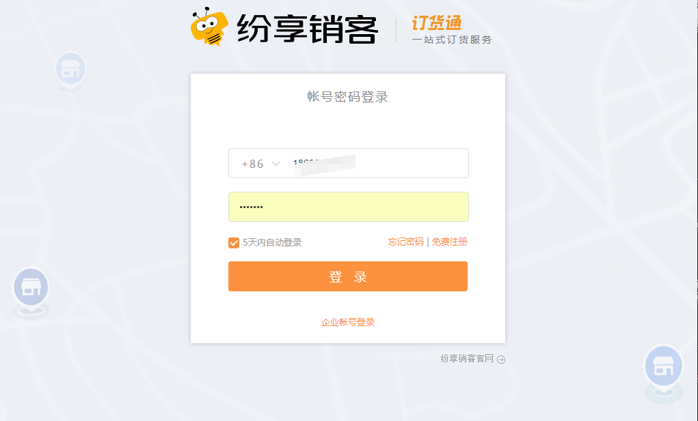  

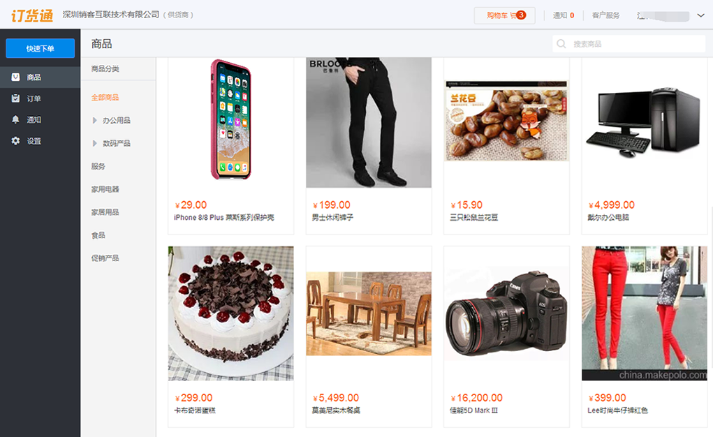  