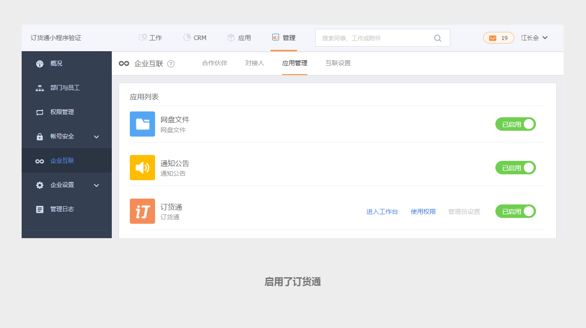
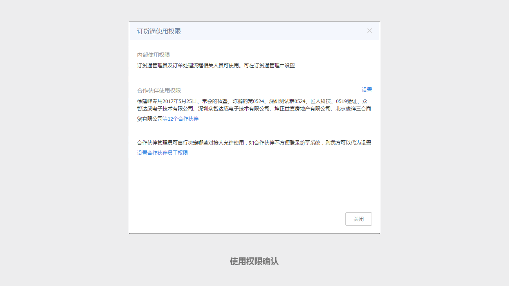
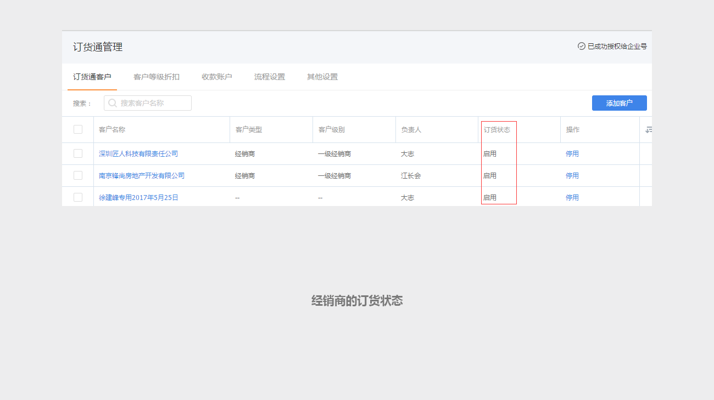
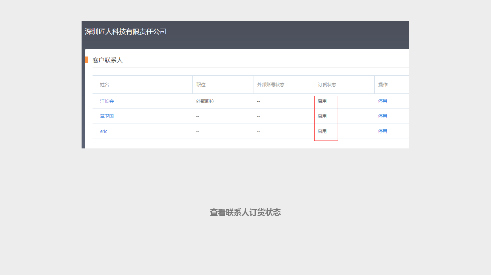

## 为什么经销商进入订货通，提示没有权限？ ##

没有权限有好几种情况，需要排查企业互联设置和订货通管理两个地方。

首先就是应该排查企业互联平台的设置，在【管理】-【企业互联】-【应用管理】中找到订货通应用，确认是否启用了订货通。

然后在点击“使用权限”，确认经销商是否在合作伙伴的使用权限中，如果没问题，然后再看一下，是否在员工权限中。

如果以上都没有问题，进入CRM-【CRM】-【订货通管理】中，找到该经销商的订货状态。

如果没问题，然后在点击该经销商，查看下面联系人的订货状态。

