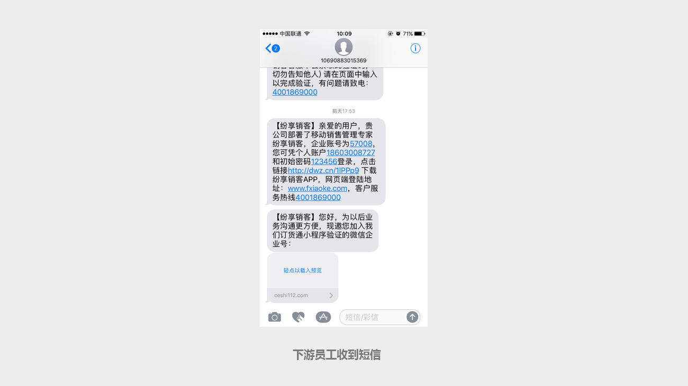
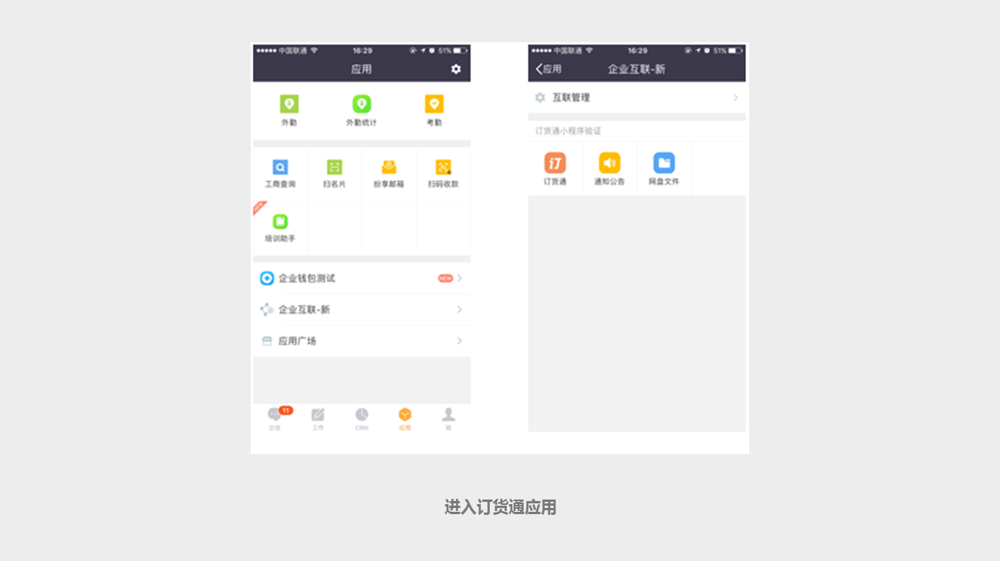
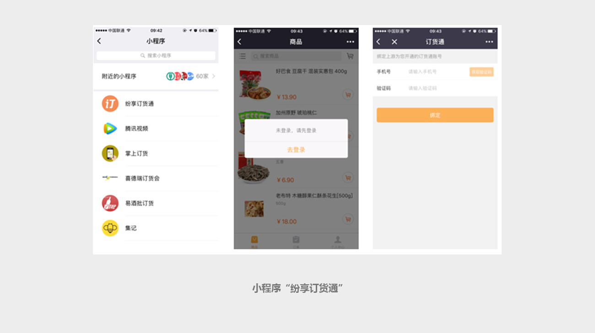

## 导入或新建合作伙伴，并增加订货通权限后，合作伙伴怎么才能订货？ ##

在导入或新建合作伙伴时，系统自动创建下游企业和员工。待创建成功后，下游员工会收到短信，短信里面提示下载销客App。

安装完成后，打开销客App，输入短信中的账号和密码，进入【应用】-【企业互联】中，就可以看到上游企业授权的订货通应用，点击进入即可订货。

还有一种更简单的办法，就是让合作伙伴在微信中搜索小程序“纷享订货通”，输入自己的手机，短信验证，即可订货。

