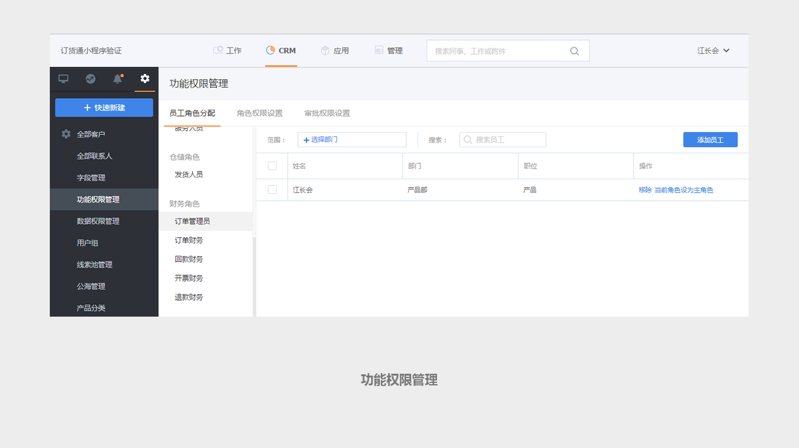
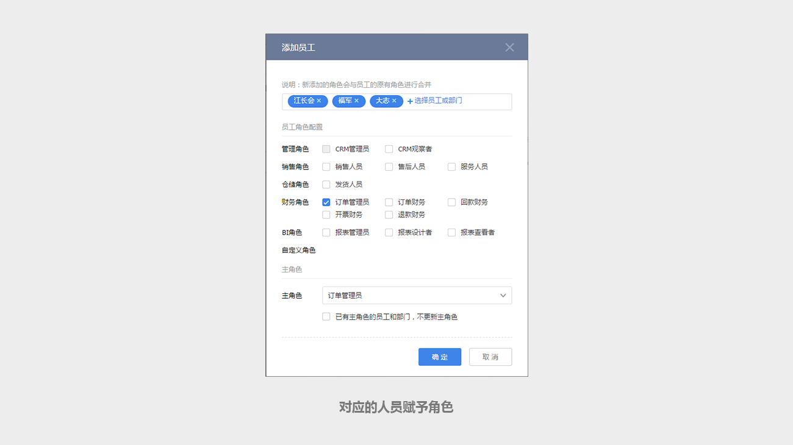
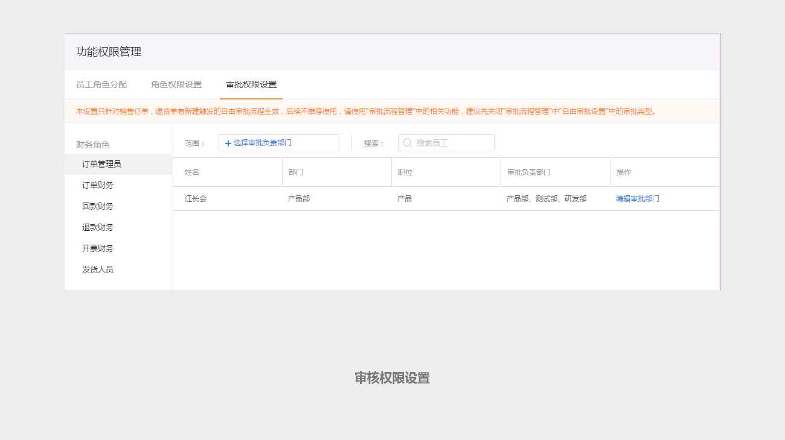

## 经销商提交订单后，上游怎样进行订单确认和发货？ ##

经销商提交的订单与销售提交的订单一样，需要在CRM设置角色和审核人员。

在【CRM】-【CRM】-【功能权限管理】里面，找到订单管理员、订单财务、发货人员等角色。

将对应的人员赋予这些角色。

然后根据CRM客户的负责人所在的部门，进行审核权限设置。比如深圳销售部的订单由张三审核，则编辑张三的审批负责部门上增加“深圳销售部”。

