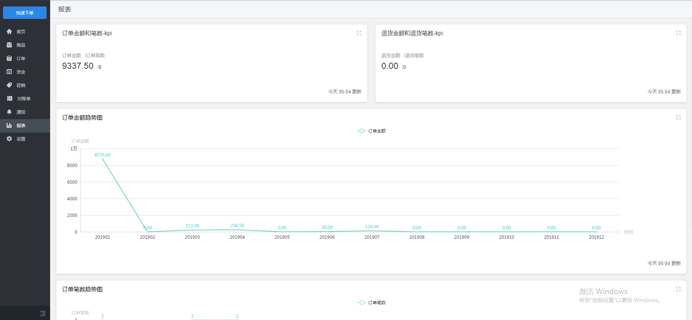
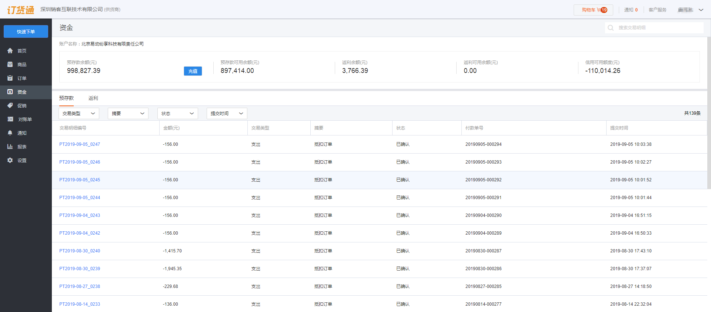
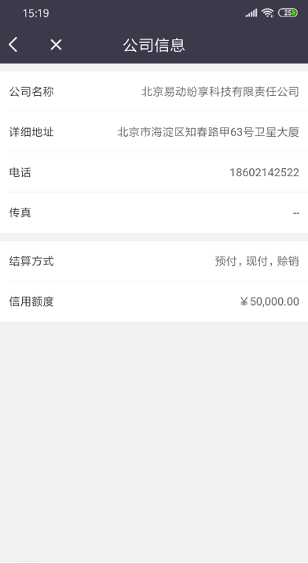
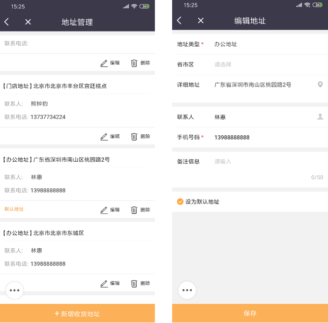

## 其他设置
其他设置主要包含的为订货主流程以外的一些辅助内容和设置项，如经营报表、发票信息、收货地址管理等。
### 1、统计报表
订货商在订货通进行日常订货后，订货通将在首页根据交易记录自动生成部分报表，订货商可自行查看统计报表，可对经营策略的调整提供一定的参考，目前只支持通过web端（电脑浏览器）进行查看，移动端不支持查看报表。 
无租户模式的用户可通过微信扫码登录的方式进行web端进行查看报表。[dht.fxiaoke.com](https://note.youdao.com/)
  

### 2、个人中心
#### 资金账户
资金账户会对用户当前的所有与资金相关的信息进行记录，在提交订单中已进行过详尽介绍，这里不再做过多介绍。 
注意：如果用户的个人中心未显示资金账户或资金账户没有资金数据记录，可能是企业没有购买客户账户的服务或管理员没有进行基础数据的维护，后一种情况请联系企业管理员进行解决。
  

#### 公司信息
公司信息为企业管理员维护的内容，公司信息包括公司的基本信息、结算方式和信用额度，同一CRM客户所属的所有对接联系人看到的信息都相同，且不相同。
  

#### 收货地址
收货地址管理中可以看到同一CRM客户的所有对接人创建的收货地址，在页面中可对所有收货地址进行编辑，也可以修改默认地址也可新增收货地址。
当企业管理设置为地址不可编辑时，订货端的所有订货人员都将不可进行地址编辑（新建、废弃、修改地址等），只能对已保存的地址进行选择。
当企业设置为地址允许编辑时，可以和京东淘宝一样指定收货地址，任意修改收货地址信息及联系人信息。
  

#### 发票信息
发票信息，就是开票的抬头信息，当一个公司有多个抬头时，可维护多个。维护后的发票信息在订单提交时可直接选择，如同收货地址相同。

#### 联系客服
如遇到业务操作的问题，可直接联系客服进行反馈。，进入联系客户可查看供货企业的客服电话号码。

#### 小程序
进入该页面可看到纷享订货通的小程序码，用微信扫描该码可直接进入小程序，首次进入需要绑定手机号，绑定后下次进入就可以直接进行订货了。

  

#### 账号设置
账号是指外部账号，而账号下面的信息都是CRM联系人的信息，供货方可调整自己的信息。

