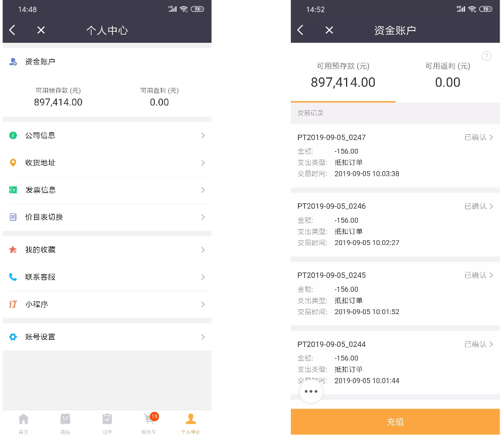
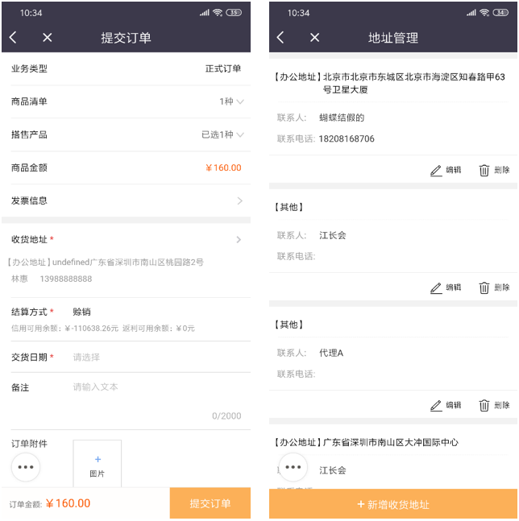
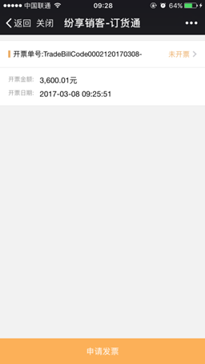
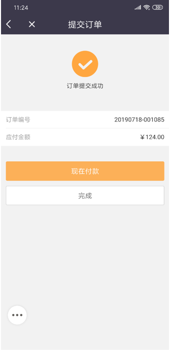
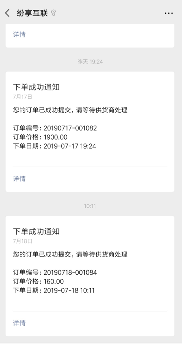

## 提交订单
商品页面选择的商品可在购物车页面进行二次选择和编辑，点击结算进入订单提交页面，提交页面需要对订单信息（发票信息、结算方式、交货日期等）进行填写，并能查看到最终的订单金额（计算订单促销后的订单最终支付金额)
### 1、订单结算方式
选择结算方式后将进行校验，校验不通过将不能提交订单
#### 预存款
在上游开启客户账户启后，预存款就可以使用了。在资金栏可查看预存款额度，订购货物过程中提交订单时选择使用预存款进行结算时，订单提交后将直接创建回款扣减预存款额度，将不会显示付款操作按钮。
- 预存款充值方式
   - 线下直接联系上游管理员，管理员可手动充值预存款金额，商家的资金账户-预存款余额将动态显示添加的金额。
   - 在订货通资金账户页面（我-资金账户-充值）直接使用线上支付（微信/支付宝）的形式进行预存款充值，充值后预存款金额增加 
   - 当支付方式-线上支付关闭后预存款将不能充值，预存款支付不受影响。

注意： 
线下充值方式可能会因为企业的审批流程，不能立刻看到资金账户的金额充值增加，需要在上游管理员审核通过后才能看到资金账户余额增加。建议使用线上支付的方式自主进行充值可立刻到账。 

预存款结算的订单默认创建回款，选择预存款结算的订单在提交订单后系统直接就会进行付款，不用手动创建付款。

  

- 创建预存款支出 
当提交订单时选择结算方式为预存款时，此时预存款可用余额将被扣减预存款金额不改变，暂用的预存款将不能再次使用，当订单审核通过后预存款金额才被扣减。

#### 赊销（信用）
赊销，是通过扣减信用额度的方式进行先发货后付款的订单结算方式，信用额度由企业的管理员进行管理和添加，信用分为正式信用和临时信用两部分。

订单结算时选择赊销，会显示当前信用可用余额及返利可用余额，当订单的额度<=当前可用信用额度+返利可用余额时，就允许提交订单，反之则不允许提交订单。

当赊销订单创建回款后信用额度将返回到客户资金账户，信用具有使用时效，是在一段时间内的值，企业管理员可进行调整，不在规定时间内，信用将不能被赊销订单使用。

注意：信用额度只可以在web端的资金中进行查看，移动端的资金页面暂未设置查看入口。但在提交页面都可以看到当前的可用信用额度。

#### 返利
返利将作为抵扣金额使用，可抵扣订单部分支付金额，在提交订单时选择使用预存款进行结算将优先扣减返利再扣减预存款金额并创建回款 
选择结算方式将校验当前结算方式的账户金额加返利是否大于等于订单金额，大于才能提交订单，现付不做校验。

### 2、收货地址
进入收货地址页面可以选择/修改地址，也可以添加新的收货地址，支持更改默认收货地址。 
在同一个对接企业中任一对接人可看到所有对接人设置的收货地址，并可以对收货地址进行选择和编辑。
  

### 3、发票信息
需要发票的客户可点击进入，填写发票信息，发票抬头和寄送地址都可以在个人中心进行单独维护，发票信息页面可直接对维护信息进行选择。 

如果提交订单时，没有提交发票申请，事后同样可提交。进入订单详情，进入发票记录中，点击【申请发票】即可。

  

提交的申请需要供货方审核并开票发票，审核后，订货方会收到微信通知。

### 4、付款
订单提交成功后可点击现在付款直接创建回款，也可以选择完成，待需要进行付款时进入订单列表页对相关订单进行付款。
  
付款分资金账户、线上支付和线下支付三类
- 资金账户付款扣减预存款
- 线上支付调用第三方支付进行支付（目前仅支持微信和支付宝支付）
- 线下支付将显示企业收款账户的账号及银行信息，可上传支付凭证照片。

注意：支付方式由企业管理员控制，具体显示的支付方式不一 

付款成功后，在付款状态中，可查看付款记录，可看到每一笔付款通过什么方式支付的，是否已确认等信息。当供货方财务确认后，订货方会收到通知，付款状态变为已确认；

### 5、订单通知
当提交的订单流转到供应商侧，将同时发送下单成功通知给订货商，表示订单已成功提交可查看订单详情，通知将通过服务号和纷享一起发送。
  

### 6、促销相关
- 订单促销将在订单提交页面进行计算与显示，订单促销的促销规则只会在购物车页面进行提示，没有进行计算和赠品显示，订单促销的金额优惠及赠品都将在提交页面统一进行显示。
- 订单提交页面将整单的商品促销、订单促销及组合促销统一进行计算和显示优惠金额。
