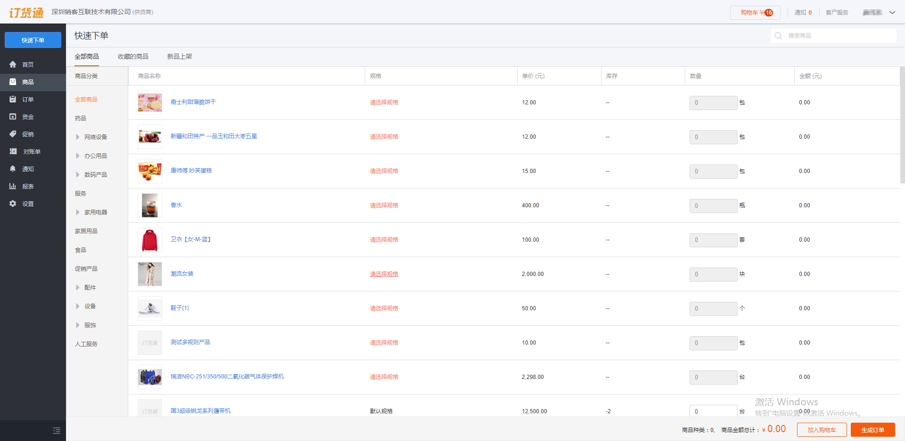
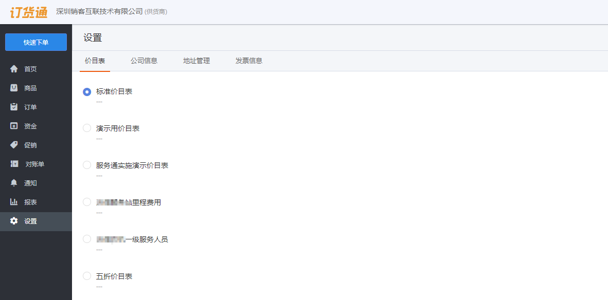
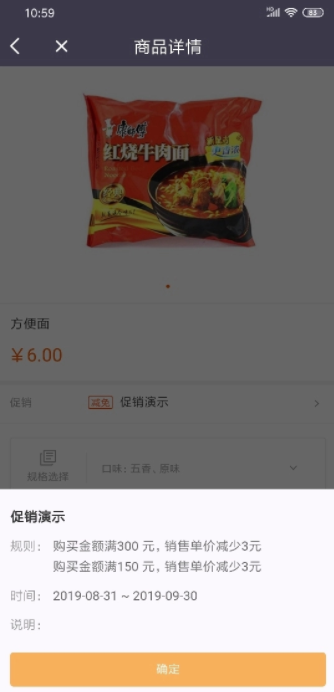

## 查看选购商品
进入订货通后就可以体验和使用整个订货通了，在订货通的多个页面都可以进行商品查看和选购，对需要订购的商品可进行选择和编辑并加入购物车，使整个订货体验打造的如同C端的京东和淘宝一般简洁高效。
### 1、快速下单
<video controls width="750">

    <source src="./media01/Order.mp4"
            type="video/webm">

    <source src="/media01/Order.mp4"
            type="video/mp4">

    Sorry, your browser doesn't support embedded videos.
</video>

快速下单页面仅在web端显示，快速下单页面可以直接进行商品选择，支持按分类过滤商品进行选购，选择好商品后可直接提交订单，最快速的完成订单提交。
  

### 2、商品列表
在商品列表页面可查看所有商品或分类过滤商品进行选购，选购后需添加到购物车进行结算提交订单。
### 3、快捷模块
#### 上架新品
新品上架列表只显示最近一个月新添加的商品，不在这个时间范围的商品将不会显示。
#### 最近订购
最近订购页面只在移动端显示，最近订购主要是针对补货场景，可以使订货商能对已购买商品快速完成补货，不用再进行商品查找。
#### 收藏页面
收藏页面可对高频订购商品进行集中展示，能够在收藏列表快速找到收藏商品进行购买添加。
#### 促销商品
促销商品只对参与商品促销和组合促销的商品进行集中展示。
#### 推荐商品
在首页能直接看到推荐商品，推荐商品是商家通过推荐设置后对订货方强烈推荐的商品，是建议订货方进行购买考虑的商品。

  
### 4、关于价目表
#### 未开启价目表：
在底部导航商品中可看到所有的商品（商家开通了价目表的情况除外），也可通过商品分类对所有商品进行筛选。支持商品搜索，可对所有商品进行商品名称的搜索。
在商品页面可直接选择需要购买的商品添加到购物车中，添加后该商品将在购物车中出现。

#### 开启价目表的情况：
仅展示当前选中的价目表内的商品，对价目表中没有的商品不显示不可查看，商品的价格随价目表进行调整，当切换价目表商品价格将切换为新价目表中的价格。
商品搜索将只能搜索当前价目表中的商品，未在价目表中的价格将不能被搜索到。
商品分类也将根据新的价目表进行调整，只会显示当前价目表中存在商品的分类。

#### 价目表切换：
  
- 价目表切换后各页面将只显示价目表明细的产品，当页面中所有产品都不在切换后的价目表明细中时将显示为空；
- 对于多规格商品，只显示价目表明细中包含的规格，没有包含的规格将被过滤不显示且不可选择；

### 关于促销
对于参与了促销的商品将在列表中显示促销标签，商品详情页面支持查看促销详情。促销详情可看到促销活动的具体规则、促销时间及促销说明等信息，可根据实际业务选择是否参与促销，合理制定购买计划。
  
