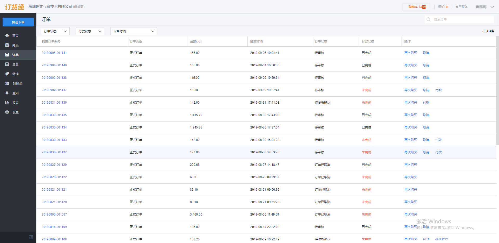
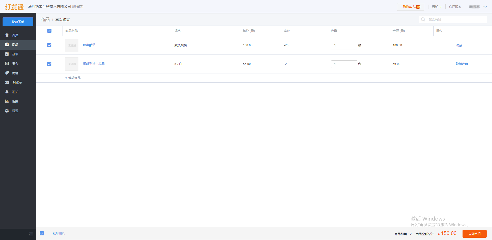
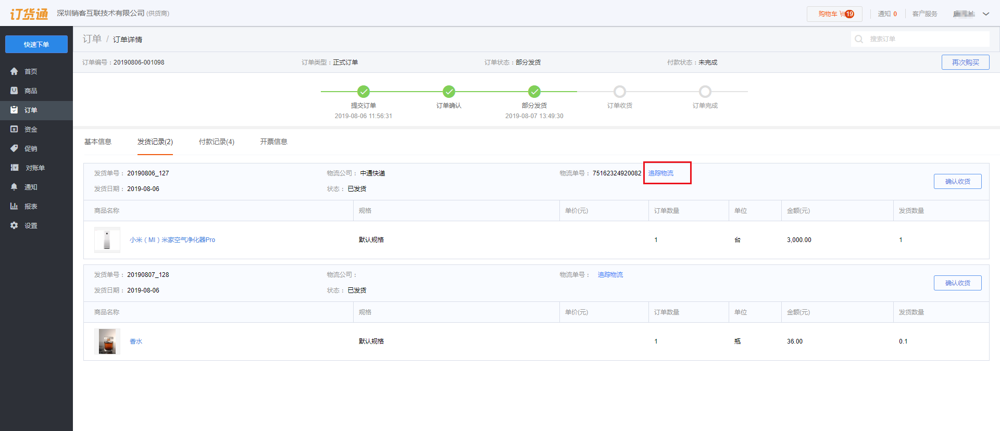

## 订单查询
订单列表页面会对所有的订单进行记录，并显示订单的订单状态及付款状态。还可进行订单详情页面查看订单的所有信息。
### 1、再次购买
对订单支持再次购买，点击再次购买会直接跳过商品选择和购物车页面进入结算页面进行订单提交。
  
  
注意:当设置了搭售商品，搭售商品将进行到再次购买的商品列表

### 2、取消订单
对已提交的订单支持进行撤回操作，撤回后的订单将不会进入到上游企业的流程中会直接取消。
注意:取消订单操作有时间限制，在订单被上游管理员审核通过后将不能进行取消，此时可联系供货企业的管理员进行解决。

### 3、订单筛选
订单支持筛选，可以根据订单的订单状态、付款状态及下单时间进行筛选。

### 4、物流查询

<video controls width="750">

    <source src="./media01/logistics.mp4"
            type="video/webm">

    <source src="/media01/logistics.mp4"
            type="video/mp4">

    Sorry, your browser doesn't support embedded videos.
</video>

订单页面支持对已发货状态的订单进行物流查询，具体操作：【点击订单】-【发货记录】-【物流查询】 
  
注意:
- 查询物流需要开启发货单，未开启发货单不能查询物流。
- 订单创建发货单（部分或整单创建）。
- 查询物流需要在发货单填写物流单号和承运商。
- 不能查询请联系管理员咨询。

### 5、收货确认
订单收货确认后才能形成一张完整流程的订单，供货商需要订货商收货后进行订单收货确认，订单准确的收货状态才能准确管理订单和准确管理业务对账，资金核算等。

注意:
当开启发货单后一张订单会允许关联多张发货单有多条物流信息，这种情况需要进行多次收货确认。
未开启发货单时订单不支持分批发货的管理模式，只会进行一次收货确认。