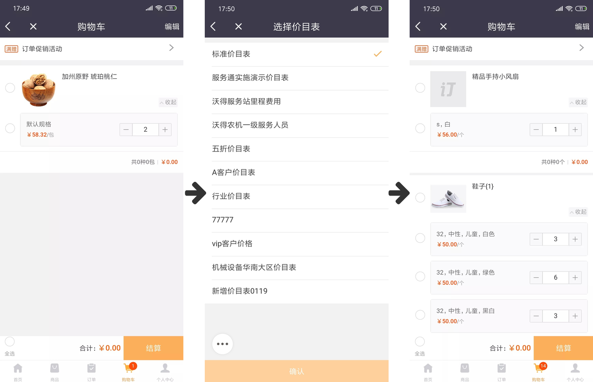

## 购物车
购物车页面将显示添加到购物车将要下单购买的商品，购物车将对各个页面添加的产品及数量规格进行记录展示，并支持实时计算选中产品的总价格和总数量。 
### 1、购物车编辑
可对添加到购物车的产品和产品数量规格进行管理，可以删除添加的商品或商品的规格，也可以修改添加商品的商品数量。

### 2、失效商品
失效商品（商品下架、商品被删除）将在购物车最下方汇总显示在失效商品中可统一删除。 

### 3、关于价目表
开启价目表后购物车只显示价目表明细中的产品，如果明细中没有将不显示，切换价目表后会隐藏掉没有的产品，对于隐藏产品在切换回价目表后可继续购买，所以切换价目表不会清空产品。

### 4、关于促销
在购物车中会对促销进行计算，显示促销规则和促销优惠金额。

切换价目表购物车页面将根据新价目表进行商品显示，只显示新价目表已有的产品，当前价目表没有的产品讲不显示，未显示商品在切换会价目表后仍会出现。 

注意：在购物车页面对订单促销不做计算和赠品展示，只提示规则。订单促销将在购物车的基础上在订单提交页面计算和展示。

  