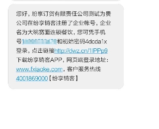

## 进入订货通
在上游企业管理员添加对接企业及外部对接人时，会为下游经销商同步发送短信提示进行接入，对接人按短信提示进行接入后就可登录进入订货通在线订货了。

### 1、接入的两种模式
- 开通纷享模式（有租户）
当上游企业为对接企业开通的为该模式时，接收到的短信会带有纷享销客的账号和密码，接收人可使用该账号和密码直接登录[https://www.fxiaoke.com/](https://www.fxiaoke.com/)，这种模式可登录纷享销客，可使用纷享APP

  

- 未开通纷享模式（无租户）
未开通纷享的模式短信会提示企业的微信服务号，可直接通过登录微信，关注企业绑定订货通的微信服务号进入订货通，不用使用纷享APP也能直接完成在线订货。

  

建议在收到短信后尽快依照提示进行登录和绑定。

### 2、登录入口
- web端  
有租户模式可直接登录账号进入订货通，无租户模式可通过网址[https://dht.fxiaoke.com/login.html?support=wx](https://dht.fxiaoke.com/login.html?support=wx)直接微信扫码进行登录。

  
- 纷享APP（仅限有租户模式） 
【应用】-【企业互联】-【订货通】
- 服务号 
使用微信关注企业的服务号选择订货通就可进行在线订货通 
首次使用需要绑定手机号，绑定后再次登陆将不再绑定可以直接进入订货通 
注意:该方式需要企业管理员提前进行服务号绑定应用还可以使用，如没有请自行联系企业管理员添加订货通应用
- 微信小程序 
小程序订货直接使用微信搜索“纷享订货通”

