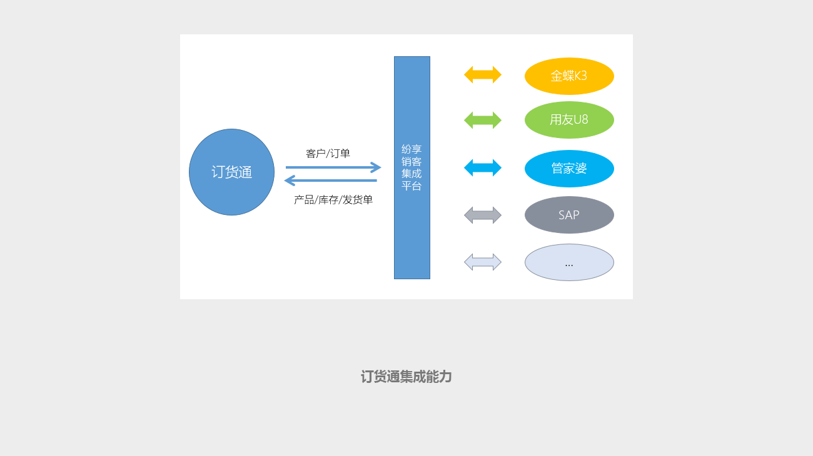
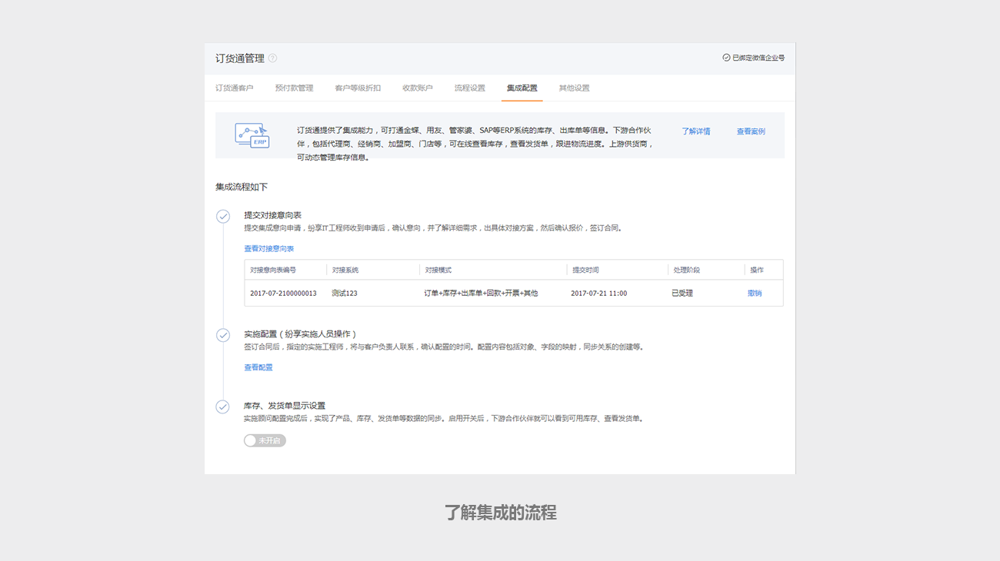
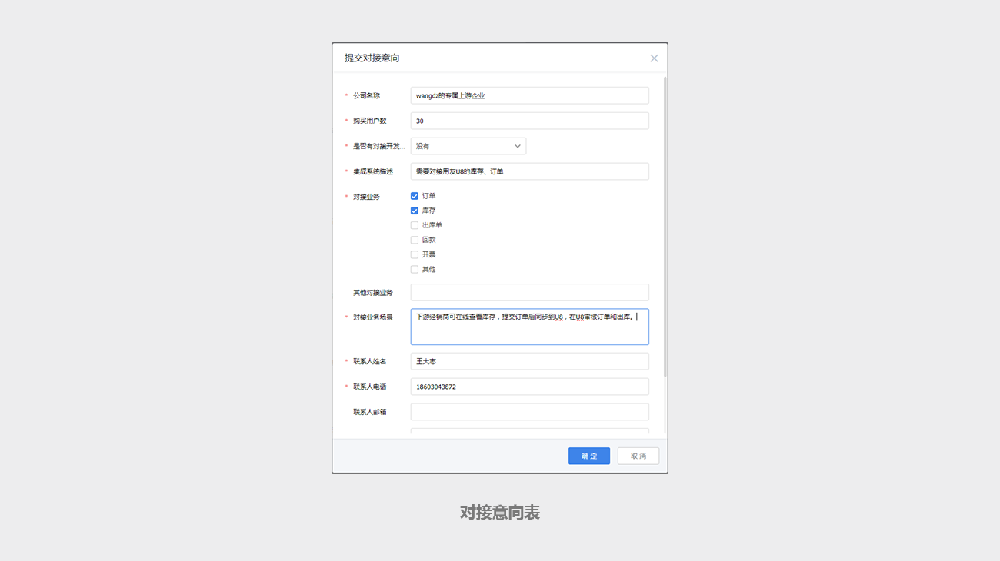
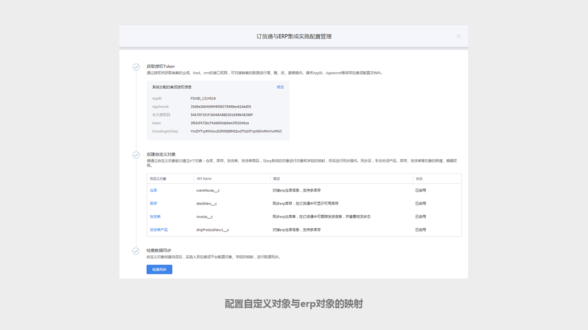
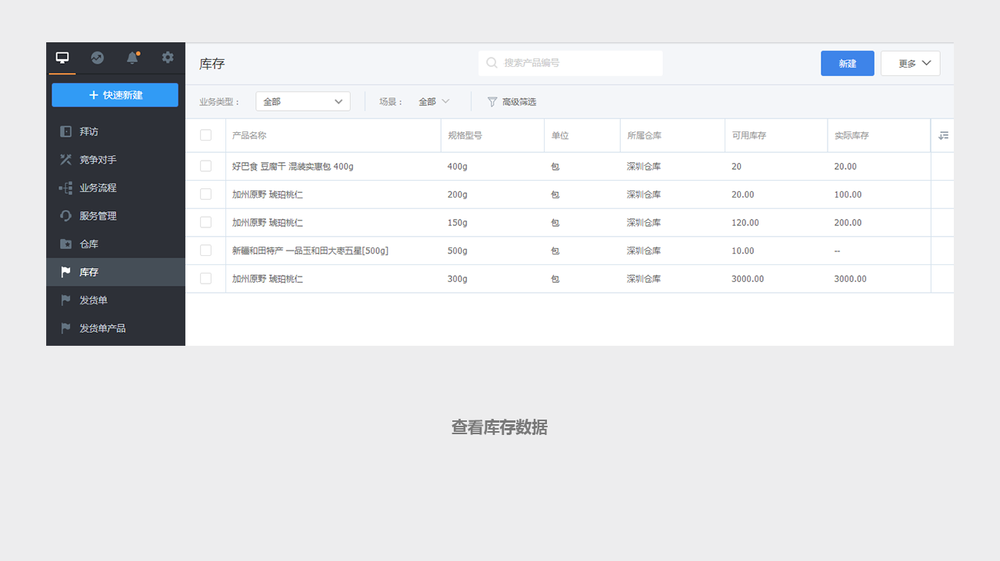
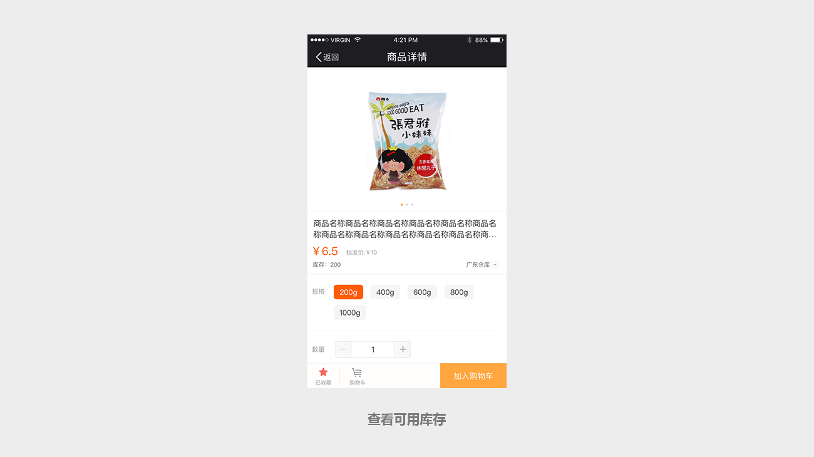

## 订货通集成ERP订单、库存的详细说明 ##

订货通提供了集成能力，可打通金蝶、用友、管家婆、SAP等ERP系统的库存、订单、出库单等信息。

下游代理商、经销商、加盟商、门店等合作伙伴，可在线查看库存，跟踪订单进度、物流状态。上游供货商，可统一管理订单，动态管理库存信息。

在【订货通管理】-【集成配置】中，可查看集成配置的详细介绍、案例，了解集成的流程。

根据企业的实际情况，提交erp对接意向表，待纷享IT对接工程师确认需求、评估工时、签订合同后，即可开展实施配置。

通过销客Paas平台能力，创建自定义对象，然后配置自定义对象与erp对象的映射（需要纷享的It工程师操作），待同步操作后，在销客里面就可以看到库存数据了。

在自定义对象中查看库存数据，可查看到每一个商品不同库存的可用库存数、实际库存数。

打开订货通的配置开关后，下游经销商、代理商等合作伙伴就可看到可用库存。当库存不足时，可设置不允许提交订单。

